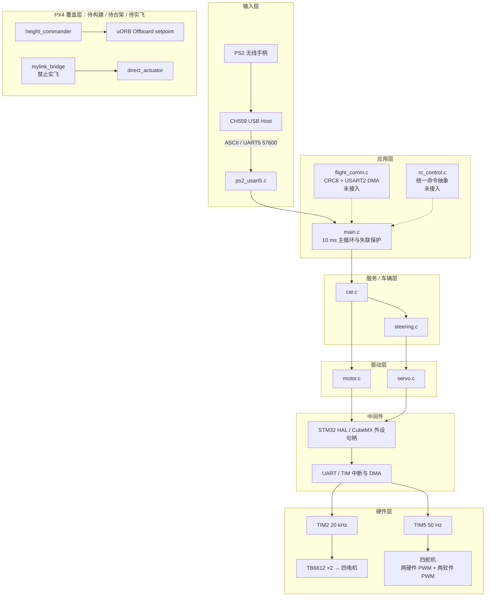
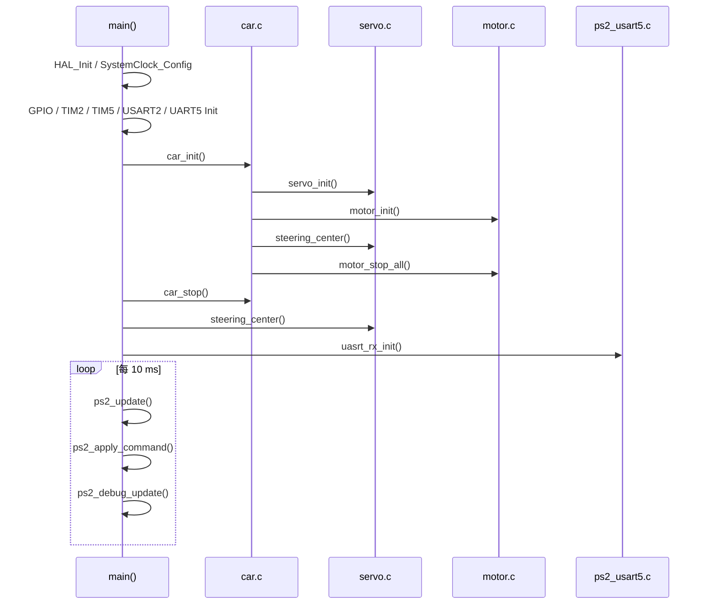
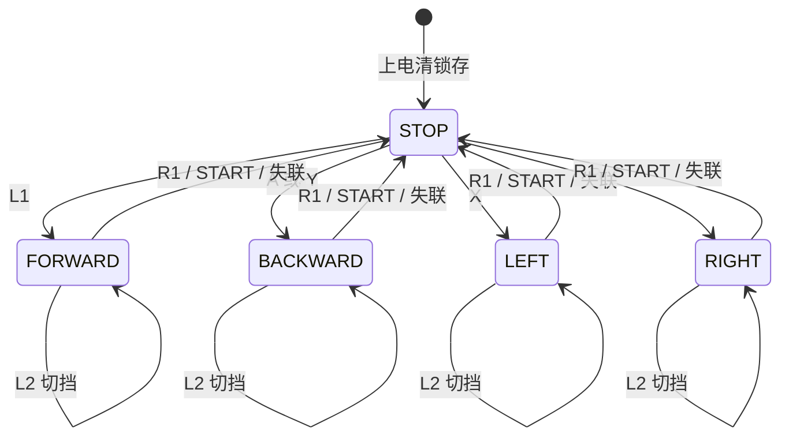
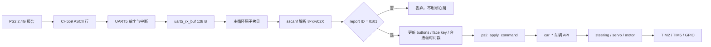

# 无人机正压攀附与四轮转向小车平台

> 一套由 STM32F103 四轮转向车控固件与 PX4 攀附飞控覆盖层组成的研发基线；当前交付边界是“小车执行层与 PS2 链路已分阶段实测，飞控联调与整机攀附仍待验证”。

| 项目速览 | 内容 |
|---|---|
| 核心平台 | STM32F103RCT6（Cortex-M3，72 MHz，256 KB Flash / 48 KB RAM）+ PX4 覆盖层 |
| 开发语言 | C（STM32 HAL）/ C++（PX4 模块）/ Python（协议调试工具） |
| RTOS | **裸机前后台**；工程含 FreeRTOS 源码与任务定义，但当前 <code>main()</code> 未调用 <code>MX_FREERTOS_Init()</code> |
| 核心技术 | TIM2 四路 20 kHz 电机 PWM、TIM5 两硬两软 50 Hz 舵机 PWM、UART 中断、USART2 DMA、CRC-8/ATM、PX4 uORB |
| 我的职责 | 车辆四层 API、PWM 驱动、PS2 控制与失联保护、CRC8 通信模块、PX4 覆盖层、文档体系；公开主线 10 commits 单人维护 |
| 项目状态 | 小车执行机构与 PS2 原始链路已实测；当前整车功能待回归；PX4、飞控—车控联调与攀附整机未完成 |

## 1. 项目简介

平台面向高空壁面或顶面的贴面作业：多旋翼负责送达、姿态稳定与施加法向正压，顶部四轮转向小车负责贴面后的移动、转向和停车。这样的拆分把飞行控制与车轮执行分到 PX4 飞控和 STM32F103 车控两个控制器上，也带来串口通信、控制权仲裁和失联安全等工程问题。

仓库交付两部分可审阅源码：一套 STM32F103 四舵机四电机小车固件，以及 <code>height_commander</code>、<code>mylink_bridge</code> 和板级配置组成的 PX4 覆盖层。它不是整机交付声明：小车基础执行机构和 PS2 链路有实物证据，当前 30/60/80% 挡与 ±90°软件命令版本仍需整车回归；PX4 覆盖层尚无完整构建、SITL 或实飞通过记录。

当前可运行的小车固件采用裸机前后台模型。UART5 中断接收 CH559 输出的 PS2 文本报告，10 ms 主循环完成合法帧判断、按键锁存与车辆命令下发；TIM5 中断生成两路软件舵机 PWM。FreeRTOS、ROS、编码器 PID、蟹行和飞控车控通信均未进入当前运行路径。

## 2. 项目演示 / 效果

**演示素材待补充。** 仓库当前没有可作为真实演示的整机照片、视频或 GIF，不使用示意图冒充实测结果。

可复核的现有证据：

| 证据 | 结论 | 边界 |
|---|---|---|
| [Keil 全量构建日志](./car/releases/PS2_NORMAL_TURN90_SPEED30_60_80/keil_rebuild.log) | ARMCC 5.06；<code>0 Error(s), 0 Warning(s)</code>；Code=16684、RO-data=852、RW-data=184、ZI-data=2696 | 构建成功不等于已烧录或已完成当前版本实车回归 |
| [发布 HEX](./car/releases/PS2_NORMAL_TURN90_SPEED30_60_80/1_template_led.hex) | 存在可烧录固件；SHA256 见 [小车固件说明](./car/README.md) | 只对应当前 STM32 固件 |
| [项目状态](./docs/PROJECT_STATUS.md) | 四舵机独立驱动与回中、四电机逐路正反转、J4 方向修正、PS2→CH559→UART5 原始链路已确认 | 不包含倒挂攀附、雷达、闭环 PID 或飞控联调 |

## 3. 核心技术栈与核心功能

### 核心技术栈

| 类型 | 技术 |
|---|---|
| MCU / 时钟 | STM32F103RCT6；HSE 16 MHz ÷2 ×9 = 72 MHz；APB1 36 MHz、APB1 Timer 72 MHz |
| 固件框架 | STM32 HAL、CubeMX 配置快照、Keil MDK5 / ARMCC 5.06 |
| 调度模型 | 裸机 10 ms 主循环 + UART5/TIM5 中断 |
| 电机控制 | TIM2 四路 20 kHz PWM、TB6612FNG ×2、方向 GPIO、STBY |
| 舵机控制 | TIM5 50 Hz；PA0/PA1 硬件 PWM，PC5/PB0 比较中断软件 PWM |
| 本地输入 | PS2 无线手柄 → CH559 USB Host → UART5 57600 8N1 → ASCII 报告 |
| 预留通信 | USART2 115200、DMA 环形接收、11 字节帧、CRC-8/ATM、失步重同步 |
| 飞控扩展 | PX4、uORB、ScheduledWorkItem、板级 <code>default.px4board</code> 覆盖 |

选择这些技术是由现有控制板与引脚资源决定的：STM32F103RCT6 和两颗 TB6612 已在板上；TIM2 完整重映射后提供四路电机 PWM；TIM5 的 CH3/CH4 物理脚被 USART2 占用，因此用内部比较时刻配合 GPIO 补足两路舵机 PWM。PX4 侧只保存自定义覆盖层，避免把整个第三方上游仓库混入项目交付。

### 核心功能

| 功能 | 实现方式 |
|---|---|
| 四电机独立正反转与调速 | TIM2 CH1~4 + TB6612 IN1/IN2/STBY；底层统一方向修正和 80% 上限 |
| 四舵机独立控制与回中 | 每路独立 <code>center/min/max/direction</code>；两路硬件 PWM + 两路软件 PWM |
| 普通四轮转向 | 前轴 <code>+angle</code>、后轴 <code>-angle</code>；车辆层缓存转向模式和角度 |
| PS2 锁存控制 | L1 直行、A/Y 后退、X/B 左右转、R1 停止、START 回中、L2 三挡切换 |
| 失联保护 | 500 ms 未收到合法 report ID <code>0x01</code> 时停车、回中并清锁存 |
| 飞控协议预留 | 11 字节固定帧、CRC-8/ATM、USART2 DMA、失步重同步；当前不启用车辆输出 |
| PX4 高度实验 | <code>height_commander</code> 用 RC 边沿触发相对高度状态机 |
| PX4 串口实验 | <code>mylink_bridge</code> 解析 ASCII 指令；默认关闭且禁止实飞 |

## 4. 系统总体架构



从硬件向上看，五层对应关系如下；PS2 解析与飞控协议属于输入中间件，所以实际调用图不是一条强行串联的直线：

| 层级 | 仓库中的真实对应 |
|---|---|
| 硬件层 | STM32F103、TIM/UART/GPIO、TB6612、四电机与四舵机 |
| 驱动层 | <code>Src/tim.c</code>、<code>Src/usart.c</code>、中断入口、HAL 句柄、<code>motor.c</code>、<code>servo.c</code> |
| 中间件 | CH559 ASCII 封帧与 PS2 解析；预留的 CRC8 / DMA <code>flight_comm</code> 和 <code>rc_control</code> |
| 服务层 | <code>car.c</code> 与 <code>steering.c</code> 提供车辆级动作和转向服务 |
| 应用层 | <code>main.c</code> 的连接判断、按键状态、挡位、优先级和 10 ms 调度 |

分层边界：

- 硬件层只呈现定时器、GPIO、H 桥和执行器资源。
- 中间件由 STM32 HAL、CubeMX 外设句柄、中断入口和 DMA 组成，把寄存器资源交给驱动层。
- 驱动层负责 PWM、方向、限幅与标定，不理解 PS2 或飞控协议。
- 车辆层把“直行 / 后退 / 转向 / 停止”组合成稳定 API。
- 应用层负责控制源语义、按键状态与失联保护。
- 当前没有可称为“已打通”的飞控—车控业务链路；CRC8 模块只是 USART2 车辆命令链路的设计预留。

## 5. 软件架构

### 入口与初始化顺序



<code>main()</code> 不调用 <code>MX_FREERTOS_Init()</code>、<code>flight_comm_init()</code>、编码器初始化或 TIM6 启动函数。因此当前固件必须描述为“裸机前后台”，不能写成使用 FreeRTOS。

### 任务、中断与 DMA

| 上下文 | 当前作用 | 共享数据 / 保护 |
|---|---|---|
| 10 ms 主循环 | PS2 解析、命令锁存、挡位切换、车辆 API 调用、200 ms 调试输出 | 读取 ISR 封好的文本行 |
| UART5 ISR | 单字节接收并在换行或长度阈值处封帧 | <code>uart5_rx_buf</code> / <code>uart5_rx_finish</code>；主循环关中断原子拷贝 |
| TIM5 ISR | UPDATE 时拉高 PC5/PB0，CC3/CC4 时拉低 | <code>servo_pending_us</code>；ISR 只写 CCR/GPIO |
| USART2 DMA | 环形接收 128 B 并解析 11 字节帧 | 源码已实现，当前未由 <code>main()</code> 启动 |
| FreeRTOS 任务 | <code>defaultTask/chassic_task/remote_task/roscommTask</code> | 仅在 <code>freertos.c</code> 定义，运行时未创建 |

### PS2 运动状态机



这里的状态机由 <code>ps2_run_latched</code>、<code>ps2_motion_command</code> 和按键沿变量实现。R1 优先级最高；START 停车后只在按下沿回中一次；L2 每个按下沿只切一挡。

## 6. 核心数据流

### 当前运行链路



失联依据是“最近一次完整且 report ID 为 <code>0x01</code> 的合法帧时间戳”，不是摇杆或按键是否变化。这样松手保持中位不会被误判为链路断开。

### 飞控协议预留链路

USART2 协议帧为 11 字节：

| Byte | 字段 |
|---|---|
| 0..1 | <code>0xAA 0x55</code> |
| 2 | version=<code>0x01</code> |
| 3 | enable（0/1） |
| 4 | mode（0=普通转向，1=蟹行） |
| 5..6 | throttle，int16 大端，-1000..1000 |
| 7..8 | steering，int16 大端，-1000..1000 |
| 9 | sequence |
| 10 | Byte0..9 的 CRC-8/ATM，poly <code>0x07</code> |

该模块可做 DMA 环形接收、CRC 校验、字段限幅和帧头重同步，也做过 USB-TTL <code>OK/CRC_ERR</code> 诊断；但 <code>FLIGHT_COMM_ENABLE_CAR_OUTPUT=0</code>，且 <code>main()</code> 未初始化它。当前 PS2 固件不会接受飞控车辆命令。

## 7. 核心模块讲解

| 模块 | 职责与设计 | 数据 / buffer / 中断与异常 | 代码入口 |
|---|---|---|---|
| <code>servo</code> | 四路舵机标定、角度映射、限幅与 PWM；两硬两软解决引脚冲突 | <code>ServoConfig</code>、<code>servo_pending_us[4]</code>；TIM5 UPDATE/CC3/CC4；HAL 失败进入 <code>Error_Handler</code> | [servo.c](./car/firmware/stm32f103-car-controller/bsp/servo.c)：<code>servo_init</code>、<code>servo_set_angle</code>、<code>servo_tim5_irq_handler</code> |
| <code>motor</code> | 四路 TB6612 驱动；方向修正集中在配置表；换向前清 PWM | <code>MotorConfig</code> + 硬件映射表；80% 硬上限；STBY 上电保持低 | [motor.c](./car/firmware/stm32f103-car-controller/bsp/motor.c)：<code>motor_init</code>、<code>motor_apply_output</code>、<code>motor_set_pwm</code> |
| <code>steering</code> | 普通四轮转向、蟹行底层 API 和回中 | 普通转向前后轴反向；每路 100 ms 错峰；角度钳 ±90° | [steering.c](./car/firmware/stm32f103-car-controller/bsp/steering.c)：<code>steering_turn</code>、<code>steering_crab</code> |
| <code>car</code> | 对上提供车辆级 API，组合电机与转向 | 缓存转向模式/角度，避免 10 ms 周期重复执行阻塞式舵机错峰 | [car.c](./car/firmware/stm32f103-car-controller/bsp/car.c)：<code>car_init</code>、<code>car_set_steering</code>、<code>car_turn</code> |
| PS2 接收与控制 | CH559 文本接收、8 字节解析、锁存与三挡、500 ms failsafe | ISR 写 <code>uart5_rx_buf[128]</code>；主循环关中断拷贝；坏帧不刷新时间戳 | [ps2_usart5.c](./car/firmware/stm32f103-car-controller/bsp/ps2_usart5.c)、[main.c](./car/firmware/stm32f103-car-controller/Src/main.c) |
| <code>flight_comm</code> | 11 字节 CRC8 协议、DMA 接收、失步重同步 | <code>flight_dma_rx_buffer[128]</code>、11 B parser；500 ms 超时；车辆输出安全门关闭 | [flight_comm.c](./car/firmware/stm32f103-car-controller/app/flight_comm.c)：<code>flight_crc8</code>、<code>flight_parser_resync</code>、<code>flight_comm_update</code> |
| <code>rc_control</code> | 协议无关 <code>RcCommand</code> 与弱符号后端 | 对 throttle/steering 限幅；500 ms 二次 failsafe；当前未接入 | [rc_control.c](./car/firmware/stm32f103-car-controller/app/rc_control.c)：<code>rc_backend_read</code>、<code>rc_update</code> |
| 编码器 / PID | TIM1/3/4/8 计数、TIM6 20 ms 采样、位置式与增量式 PID | 资源和源码保留；初始化、方向标定、闭环整定均未完成 | [encoder.c](./car/firmware/stm32f103-car-controller/bsp/encoder.c)、[pid.c](./car/firmware/stm32f103-car-controller/com/pid.c) |
| <code>height_commander</code> | RC 边沿触发的相对高度状态机，发布 Offboard setpoint | IDLE→ASCENDING→HOLDING_HIGH→DESCENDING；通道 6/7 映射风险；待构建/实飞 | [HeightCommander.cpp](./adhesion/px4-overlay/src/modules/height_commander/HeightCommander.cpp) |
| <code>mylink_bridge</code> | 解析 TAKEOFF/T/LAND/STOP 并发布 PX4 指令 | 无 CRC、认证、序列号、超时和可靠限幅；直接执行器输出；默认关闭 | [MylinkBridge.cpp](./adhesion/px4-overlay/src/modules/mylink_bridge/MylinkBridge.cpp) |

## 8. ⭐ 核心代码导览

| 文件 | 作用 | 推荐程度 |
|---|---|---|
| [Src/main.c](./car/firmware/stm32f103-car-controller/Src/main.c) | 上电顺序、裸机主循环、PS2 锁存与 500 ms 失联保护 | ⭐⭐⭐⭐⭐ |
| [bsp/servo.c](./car/firmware/stm32f103-car-controller/bsp/servo.c) | 四舵机标定与 TIM5 两硬两软 PWM | ⭐⭐⭐⭐⭐ |
| [bsp/motor.c](./car/firmware/stm32f103-car-controller/bsp/motor.c) | TB6612、方向表、80% 限幅与换向保护 | ⭐⭐⭐⭐⭐ |
| [bsp/car.c](./car/firmware/stm32f103-car-controller/bsp/car.c) | 车辆 API 与转向缓存 | ⭐⭐⭐⭐ |
| [bsp/ps2_usart5.c](./car/firmware/stm32f103-car-controller/bsp/ps2_usart5.c) | CH559 ASCII 报告接收和解析 | ⭐⭐⭐⭐ |
| [app/flight_comm.c](./car/firmware/stm32f103-car-controller/app/flight_comm.c) | CRC8、DMA 环形接收和失步重同步；未启用 | ⭐⭐⭐⭐ |
| [Src/tim.c](./car/firmware/stm32f103-car-controller/Src/tim.c) | TIM2/TIM5 参数、PWM remap、编码器资源 | ⭐⭐⭐⭐ |
| [MylinkBridge.cpp](./adhesion/px4-overlay/src/modules/mylink_bridge/MylinkBridge.cpp) | 飞控高风险路径审计样本 | ⭐⭐⭐ |
| [HeightCommander.cpp](./adhesion/px4-overlay/src/modules/height_commander/HeightCommander.cpp) | PX4 uORB 与相对高度状态机 | ⭐⭐⭐ |
| [docs/PROJECT_STATUS.md](./docs/PROJECT_STATUS.md) | 已实测 / 已实现待回归 / 未完成三分法 | ⭐⭐⭐⭐⭐ |

现场走读先从 <code>main()</code> 看真实初始化，再沿 <code>ps2_update → ps2_apply_command → car_turn/car_forward → steering/motor → servo</code> 向下走。飞控协议从 <code>flight_comm_init</code> 开始，但要立即指出它没有被 <code>main()</code> 调用；PX4 两个模块也要与 STM32 当前运行链路分开讲。

## 9. 关键技术实现

### 9.1 TIM5 两硬两软舵机 PWM

- **问题**：四个舵机需要 50 Hz PWM，但 TIM5 CH3/CH4 的 PA2/PA3 被 USART2 占用。
- **设计**：CH1/CH2 直接输出到 PA0/PA1；CH3/CH4 只作为内部比较时刻，在 PC5/PB0 上软件翻转。
- **核心实现**：UPDATE 中断写入下一周期 CCR3/CCR4 并拉高 GPIO；CC3/CC4 到点后分别拉低。
- **为什么这样做**：保留 USART2 与编码器定时器资源，不增加外部 PWM 芯片。
- **优点**：在现有硬件上补齐四路独立舵机输出；微秒值直接对应 CCR。
- **潜在问题**：中断延迟和全局关中断会带来脉宽抖动，尚无示波器定量结果。
- **代码位置**：[servo.c](./car/firmware/stm32f103-car-controller/bsp/servo.c) 的 <code>servo_tim5_channels_init</code> / <code>servo_tim5_irq_handler</code>。

### 9.2 电机方向配置与安全换向

- **问题**：J4 镜像安装后，逻辑“前进”会得到反向轮速；带 PWM 直接翻转 H 桥也有冲击风险。
- **设计**：物理差异只记录在 <code>MotorConfig.direction</code>，上层始终使用车辆坐标；换向先把 CCR 清零。
- **核心实现**：<code>MOTOR_4.direction=-1</code>；<code>motor_apply_output</code> 顺序为 PWM=0 → IN1/IN2 → PWM 幅值。
- **为什么这样做**：避免方向补丁散落到 PS2、车辆和转向层。
- **优点**：上层语义一致，轮位变化只改配置表。
- **潜在问题**：J1~J4 与 LF/RF/LR/RR 的最终物理轮位仍需重新贴标。
- **代码位置**：[motor.c](./car/firmware/stm32f103-car-controller/bsp/motor.c)。

### 9.3 合法帧心跳与锁存状态

- **问题**：用“非零摇杆活动”判断在线，会把手柄保持中位误判成失联。
- **设计**：只有完整解析且 report ID=<code>0x01</code> 的帧刷新时间戳；运动命令与连接状态分开保存。
- **核心实现**：<code>ps2_update</code> 管链路，<code>ps2_apply_command</code> 管 R1/START/L2/face key 优先级。
- **为什么这样做**：心跳表示“帧还在到达”，不是“操作者正在改变输入”。
- **优点**：链路语义准确；坏行或 report ID=<code>0x02</code> 不会延长旧命令寿命。
- **潜在问题**：当前 L1 是锁存而非 deadman，且转向路径最多会被错峰延迟阻塞约 300 ms。
- **代码位置**：[main.c](./car/firmware/stm32f103-car-controller/Src/main.c)、[ps2_usart5.c](./car/firmware/stm32f103-car-controller/bsp/ps2_usart5.c)。

### 9.4 CRC8 + DMA 环形接收 + 失步重同步

- **问题**：串口二进制帧可能丢字节、错位或被噪声破坏。
- **设计**：固定 11 字节帧、<code>AA 55</code> 帧头、字段范围、CRC-8/ATM 和 sequence；DMA 128 B 环形接收。
- **核心实现**：DMA 剩余计数换算写指针；逐字节推进 parser；失败后在已收数据中重新寻找 <code>AA 55</code>。
- **为什么这样做**：一次丢字节不应让之后所有固定帧永久错位。
- **优点**：通信层可单独诊断，并用 <code>FLIGHT_COMM_ENABLE_CAR_OUTPUT=0</code> 隔离车辆动作。
- **潜在问题**：USART2 仍与阻塞 <code>printf</code> 共口；尚无飞控端同协议实现和控制源仲裁。
- **代码位置**：[flight_comm.c](./car/firmware/stm32f103-car-controller/app/flight_comm.c)。

### 9.5 PX4 覆盖层而非整仓复制

- **问题**：完整 PX4 仓库体积大、第三方代码多，项目自定义内容容易被淹没。
- **设计**：只保存两个模块及其参数、CMake/Kconfig 和三个板级 <code>default.px4board</code> 覆盖文件。
- **核心实现**：<code>height_commander</code> 发布 uORB Offboard 位置目标；<code>mylink_bridge</code> 保留历史串口实验路径。
- **为什么这样做**：让自研差异可审查，同时保留指定上游基线的复现方式。
- **优点**：仓库边界清楚，避免把完整第三方源码算作个人工作。
- **潜在问题**：当前无完整 PX4 构建日志、<code>.px4</code>、SITL 或实飞结果；<code>mylink_bridge</code> 禁止实飞。
- **代码位置**：[PX4 覆盖层](./adhesion/px4-overlay/)。

## 10. 技术难点

1. **资源复用而不破坏接口**：USART2 占用 TIM5 CH3/CH4 引脚后，用内部比较 + GPIO 补足舵机 PWM，同时保留定时器统一时基。
2. **前后台并发边界**：UART5 ISR 与主循环共享文本缓冲，TIM5 ISR 又要求低抖动；临界区必须短，复杂解析留在主循环。
3. **车辆坐标与物理装配解耦**：J4 镜像方向集中到 <code>direction</code> 表，而不是让每个上层调用者记住某轮反号。
4. **“能编译”与“已验证”分开**：当前固件有 Keil 构建证据，但三挡、软件命令 ±90°、PX4 和整机攀附分别处于不同验证层级。
5. **两个控制器的安全边界**：飞控和车控最终需要唯一控制源、心跳和状态回传；仓库目前只完成 STM32 侧协议预留，没有把两端说成已打通。

## 11. 问题与解决方案

### 11.1 J4 电机方向镜像

- **现象**：最小 PS2 实车直行时，J4 对应电机与其余三轮方向相反。
- **初步判断**：先区分舵机转向与驱动电机方向，架空逐路测试电机正反转。
- **排查过程**：用单轮测试确认 J1~J4，定位到 MOTOR_4，而不是 PS2 键位或舵机中位。
- **根因**：该电机物理安装方向镜像。
- **解决方案**：把 <code>motor_config[3].direction</code> 设为 <code>-1</code>，保持上层车辆坐标不变。
- **验证 / 结果**：仓库状态记录 J4 方向修正已实测；当前版本仍应在架空状态重新确认全部轮位标签。

### 11.2 PS2 0x4F 键值误读

- **现象**：早期诊断曾把 Byte5 的 <code>0x4F</code> 标成 R2。
- **初步判断**：检查 CH559 报告中面键字段和肩键字段是否混用。
- **排查过程**：对照报告帧与头文件：Byte5 是面键编码，Byte6 才是肩键位图。
- **根因**：把两种字段按同一种“非零按键”模型解释。
- **解决方案**：Byte5 映射 Y/A/X/B；Byte6 用位掩码解析 L1/R1/L2/R2 等，支持组合按键。
- **验证 / 结果**：开发记录确认 <code>0x4F</code> 为 A/CROSS；当前 <code>main.c</code> 使用解析后的 <code>right_key</code>。

### 11.3 失联判据从“活动”改为“合法帧”

- **现象**：旧逻辑按非零摇杆/按键刷新时间，手柄保持中位时会被当作无活动。
- **初步判断**：链路存活与用户操作量是两个不同信号。
- **排查过程**：检查 <code>remote_stopped_flag</code> 旧逻辑与 <code>main.c</code> 新心跳逻辑。
- **根因**：把输入变化当作链路心跳。
- **解决方案**：仅在完整 <code>0x01</code> 报告到达时刷新 <code>ps2_last_valid_frame_ms</code>；500 ms 超时停车、回中、清锁存。
- **验证 / 结果**：当前代码和构建记录可确认逻辑已接入；关闭手柄/拔接收器的当前版本整车回归仍应按测试清单复测。

### 11.4 ⚠️ 工程风险分析：软件 PWM 抖动

- **现象**：PC5/PB0 边沿依赖 TIM5 ISR，可能被 UART5 中断或主循环关中断推迟。
- **初步判断**：抖动来源应按中断优先级、临界区长度和 ISR 执行时间拆分。
- **排查过程**：静态检查确认 TIM5/UART5 同为优先级 5，<code>ps2_copy_line</code> 会短时全局关中断。
- **根因**：软件生成边沿天然依赖中断响应延迟。
- **解决方案**：已把 TIM5 ISR 压缩为 CCR/GPIO 操作；下一步用示波器测 PC5/PB0 周期与高电平时间。
- **验证 / 结果**：尚无定量抖动数据，不能写成“已解决”。

### 11.5 ⚠️ 工程风险分析：±90° 命令不等于机械角

- **现象**：X/B 调用 <code>car_turn(±90°)</code>，但舵机输出被 1300~1700 μs 钳位。
- **初步判断**：软件角度、PWM 脉宽和机械转角是三种量。
- **排查过程**：沿 <code>car_turn → steering_turn → servo_set_angle</code> 查看双重限幅与线性映射。
- **根因**：角度参数只是软件归一化尺度，机械结果受舵机、摇臂和连杆影响。
- **解决方案**：README 明确边界；正式回归从小角度、低挡和轮胎架空开始。
- **验证 / 结果**：机械 ±90°无干涉尚未验证。

### 11.6 ⚠️ 工程风险分析：mylink_bridge 安全缺口

- **现象**：ASCII <code>T value</code> 可直接发布四路相同推力。
- **初步判断**：检查解析校验、认证、限幅、心跳、姿态闭环与默认使能状态。
- **排查过程**：源码无 CRC、认证、序列号和命令超时，<code>strtof</code> 结果无可靠范围检查，并使用 <code>direct_actuator</code>。
- **根因**：历史实验桥没有按可飞行链路设计。
- **解决方案**：<code>MLB_ENABLE</code> 默认 0；后续删除或永久禁用直接执行器路径。
- **验证 / 结果**：**禁止实飞**；当前也没有飞行验证证据。

## 12. 工程优化

### 已实现

| 优化 | 代码体现 | 收益与代价 |
|---|---|---|
| 舵机启动错峰 | 四路输出间隔 100 ms 启动 | 降低同时启动电流阶跃；增加约 300 ms 启动时间 |
| 转向缓存 | 只在模式或角度变化时更新四舵机 | 避免每 10 ms 重复触发阻塞式错峰 |
| 安全换向 | 清 PWM 后再切 IN1/IN2 | 降低带占空比翻转 H 桥的冲击风险 |
| 方向集中配置 | <code>MotorConfig.direction</code> | 上层保持统一车辆坐标 |
| 合法帧 failsafe | PS2、flight_comm、rc_control 各自 500 ms 超时 | 防止旧油门持续生效；当前只启用 PS2 路径 |
| CRC 与重同步 | CRC-8/ATM + 搜索 <code>AA 55</code> | 单字节丢失后可重新对齐；模块未接入运行固件 |
| 按键沿检测 | L2 / START 保存上一周期状态 | 长按只触发一次 |

### 如果重做

按安全优先级推进：

1. L1 从锁存改成 deadman，并增加能切断 TB6612 STBY 或动力电源的物理急停。
2. 用非阻塞状态机替代舵机和转向路径中的 <code>HAL_Delay(100)</code>，避免失联检查被延后。
3. 把 USART2 二进制协议与阻塞式 <code>printf</code> 分离，再实现唯一控制源 Control Manager。
4. 加 IWDG、复位原因记录与 HardFault 安全停车策略。
5. 先逐轮验证编码器 A/B 相、方向和计数，再启用单轮速度 PID；旧 Kp/Ki 不能直接复用。
6. 用示波器量化软件 PWM；不满足要求时调整硬件引脚或改用外部 PWM 芯片。
7. 删除 <code>mylink_bridge</code> 的直接执行器路径，飞控功能按 SITL→无桨台架→防护环境顺序验证。

## 13. 项目目录结构

```text
.
├─ car/
│  ├─ firmware/stm32f103-car-controller/  # 完整 Keil/CubeMX 小车工程
│  │  ├─ Src/                             # main、TIM、USART 与中断入口
│  │  ├─ bsp/                             # car / steering / servo / motor / PS2 / encoder
│  │  ├─ app/                             # flight_comm / rc_control / 历史任务代码
│  │  ├─ com/                             # PID 与调试工具
│  │  └─ MDK-ARM/                         # Keil 工程入口
│  ├─ hardware/                           # 小车控制板原理图
│  └─ releases/                           # HEX 与对应构建日志
├─ adhesion/
│  ├─ px4-overlay/                        # PX4 自定义模块与板级覆盖
│  └─ hardware/reference/                 # 飞控参考资料，不代表装机型号
└─ docs/
   ├─ interview/                          # 15 篇深度技术文档
   ├─ TECHNICAL_DEVELOPMENT_DOCUMENT.md   # 开发与交接基线
   ├─ PROJECT_STATUS.md                   # 三分法项目状态
   └─ CODE_MAP.md                         # 功能到代码的索引
```

## 14. 👨‍💻 我的主要工作

以下归属采用仓库源码、开发记录、构建产物和提交记录能支撑的口径：

- 搭建并整合 <code>car / steering / servo / motor</code> 四层车辆 API。
- 实现 TIM2 四路电机 PWM、TB6612 方向/STBY、80% 上限和 J4 方向修正。
- 实现 TIM5 两路硬件 PWM + 两路比较中断软件 PWM，以及四舵机标定、限幅和错峰启动。
- 完成 PS2 报告解析、命令锁存、30/60/80% 三挡、合法帧心跳与 500 ms 失联保护。
- 实现 STM32 侧 11 字节 CRC8 协议、USART2 DMA 环形接收和失步重同步；车辆输出保持禁用。
- 编写 PX4 <code>height_commander</code> / <code>mylink_bridge</code> 覆盖源码与板级配置；飞控构建、台架和实飞未完成。
- 建立技术开发文档、代码地图、项目状态三分法和 15 篇技术文档体系。
- 公开主线历史为 10 commits 的单人维护；当前技术文档分支另有文档提交。

不把整机机械设计、雷达载荷、编码器 PID、MAVLink、ROS、自动导航、CAN、整机攀附或飞控实飞列为已完成职责。

## 15. 项目亮点

- 在同一 TIM5 时基上组合两路硬件 PWM 与两路 GPIO 比较中断 PWM，解决 USART2 占用 CH3/CH4 引脚后的四舵机输出问题。
- 用“最近合法 <code>0x01</code> 帧”而非“非零输入活动”定义 PS2 心跳，失联时统一停车、回中并清锁存。
- 把电机镜像方向、PWM 上限和舵机标定集中在配置表，让车辆层保持一致坐标语义。
- 为预留 UART 链路实现 CRC-8/ATM、DMA 环形接收和失步重同步，同时用编译期开关与未初始化状态阻止车辆输出。
- 以“已实测 / 已实现待回归 / 未完成”三分法维护证据边界，不把构建记录扩大为整机验证。

## 16. 🎯 项目能力映射

| 能力 | 项目中的体现 |
|---|---|
| STM32 外设与时钟 | HSE/PLL/APB 推导，TIM2/TIM5 参数计算，AFIO remap，UART/DMA 配置 |
| 裸机并发 | ISR 与主循环分工、共享缓冲临界区、定时器边沿实时性分析 |
| 驱动开发 | TB6612、舵机 PWM、方向与标定表、GPIO 初始安全状态 |
| 分层设计 | 输入 → 应用 → 车辆 → 转向/驱动 → 硬件，车辆 API 隔离控制源 |
| 通信协议 | ASCII 报告解析、固定二进制帧、CRC8、DMA 环形缓冲、失步重同步 |
| 安全意识 | 上电停车、STBY、失联保护、软件/机械角区分、危险飞控路径禁用 |
| 调试复盘 | J4 镜像、PS2 字段误读、合法帧心跳、软件 PWM 风险定位 |
| 工程交付 | Keil 构建日志、HEX 哈希、状态文档、代码导航与复现说明 |

## 17. 🎤 项目设计总结

### 项目摘要

“这是一个无人机正压攀附与四轮转向小车平台。我负责 STM32F103 车控固件和 PX4 覆盖层。车控是裸机前后台：TIM2 四路 20 kHz PWM 带四个电机，TIM5 两路硬件加两路软件 PWM 带四个舵机；PS2 经 CH559 走 UART5，500 ms 没有合法帧就停车回中。现在小车执行层和 PS2 原始链路有实物验证，飞控联调和整机攀附还没完成。”

### 核心设计说明

“这个平台让无人机负责送达和施加法向正压，四轮小车负责贴面后的移动。车控用 STM32F103RCT6，当前没有启动 FreeRTOS，而是 10 ms 主循环配合 UART5 和 TIM5 中断。电机由 TIM2 四路 20 kHz PWM 驱动两颗 TB6612；舵机用 TIM5 50 Hz，其中 PA0/PA1 是硬件 PWM，PC5/PB0 用更新中断拉高、比较中断拉低生成软件 PWM。PS2 手柄先由 CH559 转成 ASCII 报告，只要 500 ms 收不到合法 0x01 帧就停车、回中、清锁存。飞控侧保留两个 PX4 模块和 STM32 端 CRC8 协议，但还没有端到端联调；mylink_bridge 直接写执行器，所以明确禁止实飞。”

### 完整技术说明

“背景是高空壁面或顶面的贴面检测：多旋翼负责飞行和法向压紧，小车负责贴面移动，所以系统分成 PX4 飞控和 STM32 车控。我的主要工作是车控分层、执行器驱动、本地遥控、预留通信和 PX4 覆盖层。

车控从上到下是 PS2 输入、main 应用逻辑、car 车辆层、steering 转向层、servo/motor 驱动层。main 只初始化 GPIO、TIM2、TIM5、USART2 和 UART5，没有调用 FreeRTOS。PS2 经 CH559 变成一行 ASCII，UART5 中断只收字节，主循环再 sscanf 解析 8 个字段。只有完整的 0x01 报告刷新时间戳，500 ms 超时就停车、回中并清锁存。

硬件上最值得讲的是四舵机：TIM5 的 CH3/CH4 引脚 PA2/PA3 被 USART2 占了，我保留 CH3/CH4 的比较事件，在 PC5/PB0 上用更新中断拉高、比较中断拉低，和 PA0/PA1 两路硬件 PWM 共用 50 Hz 时基。电机侧用 TIM2 20 kHz PWM 和 TB6612，J4 镜像安装的反向只在 direction 表里修正，换向时先把 PWM 清零。

通信方面，我写了 STM32 侧 11 字节协议：AA55 帧头、CRC-8/ATM、USART2 DMA 环形接收和失步重同步。不过车辆输出宏保持 0，main 也没初始化它，因为 USART2 还在输出调试日志，控制权仲裁也没完成。

结果上，Keil 全量重建是 0 错误 0 警告，也有对应 HEX。能证明的是四舵机、四电机、J4 修正、PS2 原始链路和最小直行停止版本；当前三挡和 ±90°软件命令还要整车回归，飞控没有构建和实飞证据。这几个边界我会主动讲清楚。”

## 18. 设计思考与 FAQ

### 1. 为什么说当前是裸机，不是 FreeRTOS？

工程虽含 FreeRTOS 源码和 <code>MX_FREERTOS_Init()</code>，但 <code>main()</code> 从未调用它，也没有启动调度器。当前运行结构是主循环 + TIM5/UART5 中断。

### 2. TIM2 的 20 kHz 怎么算？

APB1 Timer 时钟为 72 MHz，<code>PSC=35</code>、<code>ARR=99</code>，所以 <code>72 MHz / 36 / 100 = 20 kHz</code>。

### 3. TIM5 为什么能直接用微秒写 CCR？

<code>PSC=71</code> 把 72 MHz 分到 1 MHz，即 1 μs/计数；<code>ARR=19999</code> 得到 20 ms 周期，也就是 50 Hz。

### 4. 两路软件 PWM 怎么产生？

TIM5 UPDATE 时把 PC5/PB0 拉高并装载 CCR3/CCR4；比较事件到达时分别拉低。CH3/CH4 只提供内部比较时刻，不输出 PA2/PA3。

### 5. 软件 PWM 最大风险是什么？

边沿会受中断排队和关中断时间影响。代码已精简 ISR，但尚未用示波器量化，不能报具体抖动数据。

### 6. 为什么 J4 的 direction 是 -1？

实车逐路测试确认 J4 电机安装方向镜像。修正放在底层配置表，避免上层针对单轮打补丁。

### 7. 失联为什么依据合法帧而不是摇杆活动？

摇杆保持中位时输入不变化，但链路仍在线。只有完整 <code>0x01</code> 报告到达才代表心跳；500 ms 无合法帧才判失联。

### 8. CRC8 参数与覆盖范围是什么？

CRC-8/ATM，poly=<code>0x07</code>、init=<code>0x00</code>、无反射、xorout=<code>0x00</code>；覆盖 11 字节帧的 Byte0~9。

### 9. 丢一个字节后如何恢复？

11 字节校验失败后，parser 在现有缓冲中重新查找 <code>AA 55</code>；末尾只有 <code>AA</code> 时保留它等待下一字节。

### 10. 飞控和小车已经打通了吗？

没有。STM32 侧只实现了 CRC8 车辆协议预留，当前运行固件未启用；PX4 覆盖层也没有同协议的已验证发送链路与仲裁。

### 11. 编码器 PID 做完了吗？

没有。TIM1/3/4/8、TIM6、<code>encoder.c</code> 和 PID 源码存在，但 <code>main()</code> 不初始化、不启动，方向与参数也未整定。

### 12. 蟹行和 ±90°转向验证到什么程度？

底层有 <code>car_crab/steering_crab</code>，但当前 PS2 固件不启用蟹行。±90°是软件命令尺度，输出仍限在 1300~1700 μs，不代表机械转角已验证。

### 13. mylink_bridge 为什么禁止实飞？

它没有 CRC、认证、序列号、超时和可靠限幅，还通过 <code>direct_actuator</code> 直接给四路旋翼相同推力，绕过正常姿态控制意图。

### 14. 如果继续做，第一步是什么？

先完成低挡架空整车回归、轮位贴标和软件 PWM 示波器测量；之后分离 USART2 日志、实现唯一控制源仲裁，再进入飞控台架。

详细内容见 [10 技术问答](./docs/interview/10_INTERVIEW_QA.md)。

## 19. 📎 深入阅读

| 文档 | 内容 |
|---|---|
| [00 项目总览](./docs/interview/00_PROJECT_OVERVIEW.md) | 定位、场景、边界与职责证据 |
| [01 技术栈](./docs/interview/01_TECH_STACK.md) | MCU、时钟、PWM、UART、PX4 与未启用组件 |
| [02 系统架构](./docs/interview/02_SYSTEM_ARCHITECTURE.md) | 分层、启动、状态机和数据流 |
| [03 代码走读](./docs/interview/03_CODE_WALKTHROUGH.md) | 关键文件与现场讲解顺序 |
| [04 核心模块](./docs/interview/04_CORE_MODULES.md) | 模块接口、依赖和边界 |
| [05 协议与数据流](./docs/interview/05_PROTOCOLS_AND_DATAFLOW.md) | PS2 文本与 CRC8 二进制协议 |
| [06 RTOS 与并发](./docs/interview/06_RTOS_AND_CONCURRENCY.md) | 裸机前后台、中断与竞态 |
| [07 硬件交互](./docs/interview/07_HARDWARE_INTERACTION.md) | 引脚、定时器、电源与烧录 |
| [08 调试与问题复盘](./docs/interview/08_DEBUG_AND_PROBLEMS.md) | 真实 Fix 与工程风险 |
| [09 优化](./docs/interview/09_OPTIMIZATION.md) | 已实现优化与下一步 |
| [10 技术问答](./docs/interview/10_INTERVIEW_QA.md) | 分级问答与代码答案 |
| [11 项目讲解稿](./docs/interview/11_INTERVIEW_SCRIPT.md) | 30 秒到 10 分钟讲法 |
| [12 代码导航](./docs/interview/12_CODE_NAVIGATION.md) | 5 分钟 GitHub 演示路线 |
| [13 代码审计](./docs/interview/13_CODE_REVIEW.md) | Bug、风险、竞态与维护性 |
| [14 开发历程](./docs/interview/14_DEVELOPMENT_HISTORY.md) | 提交历史与版本演进 |

其他入口：[技术开发文档](./docs/TECHNICAL_DEVELOPMENT_DOCUMENT.md) · [项目状态](./docs/PROJECT_STATUS.md) · [代码地图](./docs/CODE_MAP.md) · [源文件清单](./docs/SOURCE_MANIFEST.md)。

## 20. 开发者使用

### 工程与硬件

- MCU：STM32F103RCT6；控制板：WLKJ2025011 CAR-MOTOR-V1.2S。
- Keil 工程：[1_template_led.uvprojx](./car/firmware/stm32f103-car-controller/MDK-ARM/1_template_led.uvprojx)。
- CubeMX 快照：[1_template_led.ioc](./car/firmware/stm32f103-car-controller/1_template_led.ioc)。工程含 USER CODE 区外的手工改动，不要无审查地整工程重新生成。
- 小车原理图：[CAR-MOTOR-V1.2S_schematic.pdf](./car/hardware/CAR-MOTOR-V1.2S_schematic.pdf)。
- 3S 主电源、7.4 V 舵机电源和数字逻辑应分域供电并共地；禁止用飞控小电流 5 V 口直接带四个大扭矩舵机。
- 飞控型号尚未冻结，参考 PDF、板级目标与实际装机板不能互相替代。

### 编译与烧录

1. 用 Keil MDK5 打开 [1_template_led.uvprojx](./car/firmware/stm32f103-car-controller/MDK-ARM/1_template_led.uvprojx)。
2. 选择 target <code>1_template_led</code>，执行 Rebuild，确认 <code>0 Error(s), 0 Warning(s)</code>。
3. 四轮完全架空，确认接线、舵机电源和电机停止状态。
4. 通过 ST-Link/SWD 手动 Download；不要让 ST-Link 3.3 V 与板载供电互相反灌。
5. 重新上电后先确认停车和回中，再从 30% 挡测试。

仓库不会自动烧录、自动解锁飞控或自动启动电机。当前发布文件在 [PS2_NORMAL_TURN90_SPEED30_60_80](./car/releases/PS2_NORMAL_TURN90_SPEED30_60_80/)。

### PS2 使用

| 输入 | 当前动作 |
|---|---|
| L1 | 锁存直行 |
| A / Y | 锁存后退 |
| X / B | 锁存普通四轮左 / 右转并前进，软件命令角 ±90° |
| R1 | 立即停车并清除运动锁存 |
| L2 | 30% → 60% → 80% → 30% 按下沿切挡 |
| START | 停车、回中并清除锁存 |

500 ms 无合法 <code>0x01</code> 报告时自动停车、回中并清锁存。SELECT、蟹行、编码器 PID、FreeRTOS、ROS 与飞控 UART 当前不启用。

### 车辆 API

| 层 | API |
|---|---|
| 车辆 | <code>car_init</code>、<code>car_stop</code>、<code>car_forward</code>、<code>car_backward</code>、<code>car_turn</code>、<code>car_crab</code> |
| 转向 | <code>steering_center</code>、<code>steering_turn</code>、<code>steering_crab</code> |
| 电机 | <code>motor_init</code>、<code>motor_set_pwm</code>、<code>motor_set_all</code>、<code>motor_stop_all</code>、<code>motor_percent_to_pwm</code> |
| 舵机 | <code>servo_init</code>、<code>servo_set_us</code>、<code>servo_set_angle</code>、<code>servo_center</code>、<code>servo_center_all</code> |

### PX4 覆盖层

覆盖层以仓库记录的 PX4 上游基线为前提，只保存项目自定义文件。应用 [adhesion/px4-overlay](./adhesion/px4-overlay/) 后，可按实际硬件选择 SITL 或目标板构建；仓库当前没有完整通过日志，不能把配置文件存在写成构建成功。<code>mylink_bridge</code> 必须保持关闭，禁止实飞。

### License

- STM32 HAL、CMSIS、FreeRTOS 与 PX4 文件继续受各自文件头和上游许可证约束。
- 仓库没有为全部内容声明一个统一许可证，也不因收录第三方文件而改变其许可条件。
- 合同、人员分工、付款信息、私有归档、完整第三方 PX4 仓库与构建缓存不在本公开仓库范围内。
