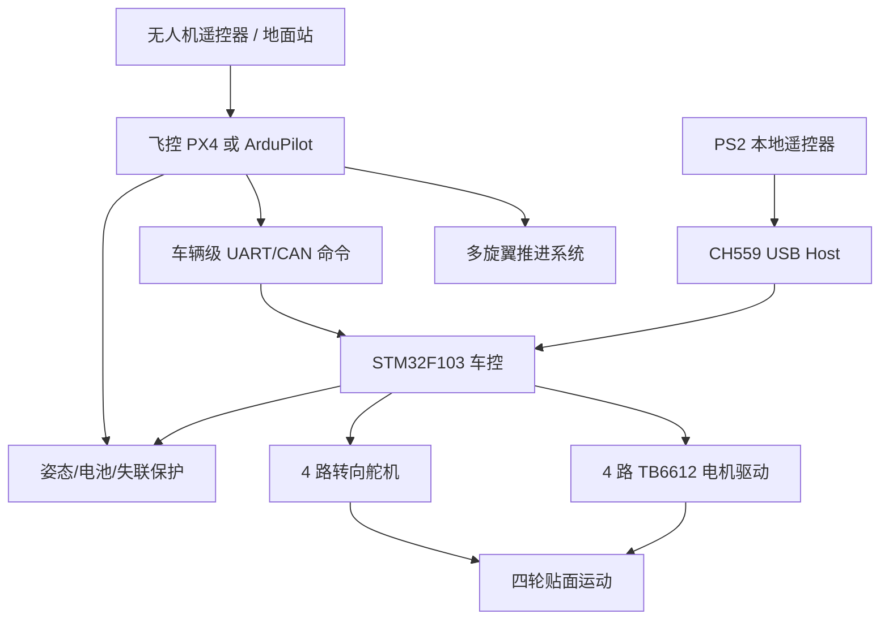
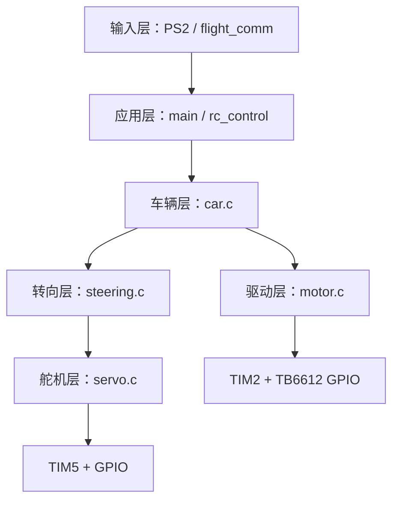
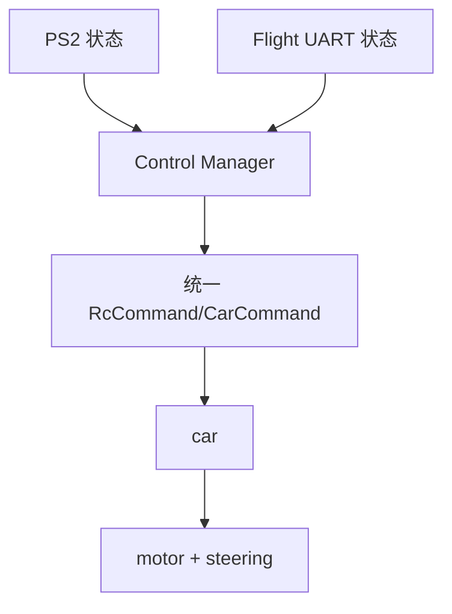

# 无人机载四轮转向小车攀附平台技术开发文档

文档版本：V1.0

更新日期：2026-08-17

适用仓库：`uav-car-adhesion-platform`
文档状态：开发基线与交接说明，不替代飞行安全评审、结构强度计算或实机验收报告

## 1. 文档目的

本文把“无人机攀附平台”和“STM32 四轮转向小车”两个研发方向收敛到一个可继续开发的技术基线，重点回答以下问题：

1. 系统最终要解决什么问题，各控制器分别负责什么；
2. 当前代码真正实现到哪里，哪些结论来自实物测试；
3. 小车舵机、电机、PS2 和飞控 UART 的接口怎样工作；
4. PX4 自定义模块怎样接入上游源码，现存风险是什么；
5. 后续怎样安全地完成飞控—车控联调和机械集成；
6. 怎样编译、烧录、测试、记录证据并进行版本交接。

本文不把历史方案中的设想写成已完成功能。没有实物记录的内容统一标为“待验证”或“规划”。

> [图片占位 P01：整机总体实物图。建议文件：`docs/images/P01_system_overview.jpg`。画面应标注无人机、小车、浮动连接平台、雷达安装位和坐标系。]

## 2. 项目目标与阶段边界

### 2.1 总体目标

平台采用“多旋翼送达与提供法向正压 + 顶部四轮转向小车贴面移动 + 检测载荷采集”的组合路线。无人机负责飞行稳定、接近检测面、建立与保持压紧力以及异常脱离；小车负责四轮驱动、转向、停车和后续轮速/接触状态采集。



### 2.2 当前阶段

当前仓库的可靠基础是“小车执行层 + PS2 本地控制”。飞控代码以自定义 PX4 覆盖层形式保存，飞控到 STM32 的二进制协议模块也已存在，但当前运行固件没有启动飞控通信。因此，当前可交付的准确表述是：

- 小车四舵机、四电机和 PS2 控制链已有分阶段实物验证；
- 当前 PS2 固件可编译并提供可烧录 HEX；
- PX4 自定义模块源码与板级配置已整理，但本次没有完整 PX4 构建/飞行通过证据；
- 无人机与小车的正式控制权仲裁、状态回传、机械压紧和端到端联调尚未完成。

### 2.3 不在当前实现中的功能

编码器闭环 PID、Ackermann 几何、自动导航、ROS 2、雷达同步、90°真实横移、自动触顶正压闭环、统一飞控/PS2 仲裁都不应被描述为已实现。源码中可能保留实验 API 或第三方框架，但当前 `main()` 没有启动这些路径。

## 3. 硬件基线与型号冻结

### 3.1 为什么必须先冻结飞控型号

历史资料中出现过 MicoAir H743-v2、WIT F722、CUAV 7-Nano V2 和 CUAV/Pixhawk V6X V2。它们的 MCU、板级目标、串口编号、接口电压和固件构建目标不同，不能只根据“PX4 飞控”四个字互换固件或接线。

| 项目 | 仓库中的角色 | 当前结论 |
|---|---|---|
| MicoAir H743-v2 | PX4 覆盖层中 `micoair_h743-v2_default` 的明确编译目标 | 源码目标；完整构建和实飞待复核 |
| PX4 FMU-v6x / CUAV V6X 类 | `mylink_bridge` 板级配置目标之一 | 实验覆盖目标；是否为实际装机板待确认 |
| WLKJ2026002UAV-WIT_F722-V3.2 | 仓库收录的硬件参考 PDF | 仅作参考；不能据此认定当前 PX4 目标就是 F722 |
| CUAV 7-Nano V2 | 采购/阶段方案中出现的候选飞控 | 采购路线信息；本仓库没有对应定制固件证据 |

正式接线或烧录前，必须记录实物丝印、MCU 型号、Bootloader、固件目标名、串口端口和电平。没有完成这张表时，不允许把某一板型的 pinout 套到另一块板上。

> [图片占位 P02：实际飞控正反面高清图。建议文件：`docs/images/P02_flight_controller_actual.jpg`。要求拍清板名、MCU、接口丝印和版本号。]

### 3.2 小车控制器

| 项目 | 参数 |
|---|---|
| MCU | STM32F103RCT6 |
| 控制板 | WLKJ2025011 CAR-MOTOR-V1.2S |
| 主电源 | 3S 锂电池，11.1 V 标称、12.6 V 满电 |
| 舵机电源 | 板载 7.4 V 电源域 |
| 电机驱动 | TB6612FNG × 2 |
| 电机 | JGA25-370/JGA25-371 12 V 减速电机，约 60 RPM，带 AB 编码器 |
| 舵机 | FEETECH FT5325M，7.4 V，PWM 位置舵机 × 4 |
| 烧录 | ST-Link / SWD |

> [图片占位 P03：小车控制板接口总览。建议文件：`docs/images/P03_car_board_pinout.jpg`。标出 J1~J4、J9/J11/J12/J14、SWD、USB-A、RX2/TX2/GND。]

### 3.3 电源分域原则

无人机主动力、小车直流电机、舵机和数字逻辑属于不同噪声与电流等级。正式集成至少应满足：

- 无人机电机/电调由飞行主电池和 PDB 供电；
- 飞控由匹配的 PMU/Power Module 稳压供电并采集电压电流；
- 小车控制板继续使用自身 3S 电源架构；
- 四个大扭矩舵机使用板载 7.4 V 或独立足够电流的 BEC，禁止由飞控 5 V 外设口供电；
- 飞控与车控串口只连接 TX、RX、GND，默认不互接 5 V；
- 所有通信设备必须共地，但高电流回路不应与信号地线共用细长回流路径。

## 4. 小车硬件资源

### 4.1 四舵机映射

| 车辆位置 | 接口 | MCU GPIO | 实现方式 | 定时资源 |
|---|---|---|---|---|
| LF 左前 | J9 | PA0 | 硬件 PWM | TIM5_CH1 |
| RF 右前 | J11 | PA1 | 硬件 PWM | TIM5_CH2 |
| LR 左后 | J12 | PC5 | 软件 PWM | TIM5 更新中断 + CH3 比较 |
| RR 右后 | J14 | PB0 | 软件 PWM | TIM5 更新中断 + CH4 比较 |

TIM5 输入时钟为 72 MHz，`PSC=71`，`ARR=19999`，得到 1 μs 计数单位和 20 ms 周期，即 50 Hz。PA0/PA1 直接使用 CCR1/CCR2；PC5/PB0 在 TIM5 周期起点拉高，并在 CCR3/CCR4 到达目标微秒数时拉低。

PB5 禁止用于舵机，它保留为 TIM3_CH2 编码器资源。

### 4.2 舵机标定与角度换算

标定表位于 `bsp/servo.c`：

```c
ServoConfig servo_config[SERVO_COUNT] =
{
  {1500U, 1300U, 1700U, 1},
  {1500U, 1300U, 1700U, 1},
  {1500U, 1300U, 1700U, 1},
  {1500U, 1300U, 1700U, 1}
};
```

每路包含 `center_us`、`min_us`、`max_us`、`direction`。`servo_set_us()` 首先做硬限幅；`servo_set_angle()` 再按 `direction` 把车辆坐标角映射到对应舵机 PWM。上层不应对单个舵机写正负号补丁。

当前软件角度上限为 ±90°，但 1300~1700 μs 的机械效果取决于舵机、摇臂孔位和转向连杆。它只代表“软件允许的命令尺度”，不是四个轮子都已完成 ±90°无干涉验证。

### 4.3 四电机映射

| 逻辑编号 | 接口 | TB6612 通道 | TIM2 PWM | PWM 引脚 | 方向 GPIO | 当前 direction |
|---|---|---|---|---|---|---|
| MOTOR_1 | J1 | TB6612_1 A | CH1 | PA15 | PC13 / PC14 | +1 |
| MOTOR_2 | J2 | TB6612_1 B | CH2 | PB3 | PC0 / PC1 | +1 |
| MOTOR_3 | J3 | TB6612_2 A | CH4 | PB11 | PB13 / PB12 | +1 |
| MOTOR_4 | J4 | TB6612_2 B | CH3 | PB10 | PC9 / PC8 | -1 |

TB6612_1_STBY 为 PC15，TB6612_2_STBY 为 PB14。`motor_init()` 先拉低两颗 STBY、将四路方向和 PWM 置零，再启动 TIM2 四个 PWM 通道，最后拉高 STBY。

TIM2 `PSC=35`、`ARR=99`，满量程为 100 个计数。当前驱动层 `pwm_max=80`，PS2 运行挡位为 30%、60%、80%。MOTOR_4/J4 的 `direction=-1` 是针对实车方向反向问题的已有修正。

J1~J4 与 LF/RF/LR/RR 的完整物理安装表仍需在下一次架空测试时贴标签确认；不能仅凭接口编号猜测车轮位置。

### 4.4 编码器资源保留

| 定时器 | GPIO | 用途状态 |
|---|---|---|
| TIM1 | PA8 / PA9 | 编码器资源保留，当前 PS2 主循环不启动 |
| TIM3 | PB4 / PB5 | 编码器资源保留，PB5 不得复用 |
| TIM4 | PB6 / PB7 | 编码器资源保留 |
| TIM8 | PC6 / PC7 | 编码器资源保留 |

目前不启用编码器 PID。后续应先逐轮验证 A/B 相方向、计数符号、每圈计数和丢脉冲，再引入单轮闭环；不能一次开启四轮 PID。

## 5. 小车软件架构与代码讲解

### 5.1 分层原则



输入层只应生成车辆级命令；车辆层调用 `motor` 和 `steering`；只有底层驱动允许操作 TIM CCR 和 GPIO。这样更换 PS2、飞控 UART 或未来 CAN 时，不需要重写 TB6612 和舵机代码。

### 5.2 `servo.c`

主要职责：

- 保存四路独立标定表；
- 初始化 TIM5 两路硬件 PWM 和两路软件 PWM；
- 对微秒值和角度做限幅；
- 提供 `servo_center_all()`、`servo_set_angle()` 等统一 API；
- 在 TIM5 中断中生成 PC5/PB0 的高低电平边沿。

四路启动时错开 100 ms，以降低大扭矩舵机同时启动的瞬时电流。软件 PWM 稳定性依赖 TIM5 中断及时响应；当前裸机主循环较简单，但后续若加入高优先级长中断、全局关中断或阻塞式串口，必须用示波器重新量化 PC5/PB0 脉宽抖动。

### 5.3 `steering.c`

- `steering_center()`：四路回各自 `center_us`；
- `steering_turn(angle)`：前轴 `+angle`，后轴 `-angle`；
- `steering_crab(angle)`：四轮同一车辆坐标角。

当前 PS2 运行模式只使用普通四轮转向，不启用蟹行。源码保留 `steering_crab()` 作为已存在的底层能力，不代表机械 ±90°横移已验证。

### 5.4 `motor.c`

`motor_set_pwm(id, pwm)` 的输入采用车辆坐标语义：正值为前进、负值为后退、0 为停止。函数先乘对应 `MotorConfig.direction`，再限制到 `pwm_max`，最后设置 TB6612 方向脚与 TIM2 CCR。

改变方向前先将该通道 PWM 清零，避免带占空比直接翻转 H 桥方向。`motor_stop_all()` 会将四个通道置零，但不关闭整个 MCU 或舵机电源。

### 5.5 `car.c`

- `car_init()`：初始化舵机与电机，回中并停车；
- `car_stop()`：只停止驱动电机，保持当前转向角；
- `car_forward()` / `car_backward()`：先回中，再给四个电机同一车辆坐标速度；
- `car_turn(angle, speed)`：设置前后轴反向转角，再给四个电机同速；
- `car_crab(angle, speed)`：设置四轮同向角，再给四个电机同速。

`car.c` 缓存当前转向模式和角度，避免每 10 ms 重复执行带 100 ms 逐舵机错峰的角度设置。

### 5.6 当前 `main.c`

启动顺序为：

```text
HAL / 时钟
→ GPIO
→ TIM2
→ TIM5
→ USART2
→ UART5
→ car_init
→ car_stop
→ steering_center
→ UART5 单字节中断接收
→ PS2 10 ms 控制循环
```

当前没有调用 `MX_FREERTOS_Init()`、编码器初始化、`flight_comm_init()` 或测试循环。

## 6. PS2 本地遥控链路

### 6.1 数据链路

```text
Twin USB Joystick 无线手柄
→ USB 无线接收器
→ 控制板 USB-A
→ CH559 USB Host
→ UART5
→ STM32F103
```

UART5：PC12/TX、PD2/RX、57600、8N1，中断逐字节接收。CH559 输出类似：

```text
HUB0_Joystick data: x01 x80 x80 x80 x80 x0F x00 x00
```

解析器只接受成功解析出 8 个字节的行；当前控制只将报告 ID `0x01` 作为有效手柄，`0x02` 被忽略。

### 6.2 已确认报告格式

| 字节 | 含义 |
|---|---|
| Byte0 | Report ID，当前有效逻辑设备为 0x01 |
| Byte1 | 右摇杆 X，当前不用 |
| Byte2 | 右摇杆 Y，当前不用 |
| Byte3 | 左摇杆 X |
| Byte4 | 左摇杆 Y |
| Byte5 | 方向键/面键编码 |
| Byte6 | 肩键/功能键位图 |
| Byte7 | 保留 |

Byte6 位定义：bit0=L1、bit1=R1、bit2=L2、bit3=R2、bit4=SELECT、bit5=START、bit6=L3、bit7=R3。

### 6.3 当前控制逻辑

当前版本采用“按键锁存”而不是“持续按住 deadman”：

| 按键 | 行为 |
|---|---|
| L1 | 选择并锁存直行 |
| A/Y | 选择并锁存后退 |
| X | 选择并锁存 `car_turn(+90°, speed)` |
| B | 选择并锁存 `car_turn(-90°, speed)` |
| R1 | 最高优先级停止，清除锁存 |
| START | 停止并回中，清除锁存 |
| L2 | 按下沿切换 30/60/80% 挡位 |
| SELECT | 当前不用 |

如果 500 ms 没有新的有效 `0x01` 报告，程序调用 `car_stop()` 和 `steering_center()`，并清空连接、按键边沿和运动锁存。

> [图片占位 P04：PS2 手柄按键图。建议文件：`docs/images/P04_ps2_controls.jpg`。在图上标注 L1、R1、L2、START、A/B/X/Y 及动作。]

### 6.4 风险说明

锁存控制方便测试，但不如持续按住使能键安全。用于倒挂贴面或与无人机集成前，建议把 L1 改回 deadman 语义，并增加独立硬件急停。仓库当前保留的是用户实测成功版本，未在本次文档整理中重构控制行为。

## 7. 飞控—车控 UART 设计

### 7.1 STM32 端现有模块

`app/flight_comm.c` 已实现固定 11 字节协议、CRC8、DMA 循环接收、失步重同步和 500 ms 超时。目标接口为 USART2：PA2/TX、PA3/RX、115200、8N1，DMA1_Channel6 接收。

| 字节 | 字段 |
|---|---|
| 0 | 0xAA |
| 1 | 0x55 |
| 2 | version，固定 0x01 |
| 3 | enable，0/1 |
| 4 | mode，0=普通转向，1=蟹行 |
| 5~6 | throttle，int16，大端，范围 -1000~1000 |
| 7~8 | steering，int16，大端，范围 -1000~1000 |
| 9 | sequence |
| 10 | CRC8 |

CRC8 初值为 0，多项式为 `0x07`，覆盖 Byte0~Byte9。合法帧回复 `OK\r\n`，CRC 错误回复 `CRC_ERR\r\n`。

### 7.2 当前为什么没有启用

当前 `flight_comm.h` 中 `FLIGHT_COMM_ENABLE_CAR_OUTPUT=0`，且 `main.c` 不调用 `flight_comm_init()`。USART2 还被 `printf` 用作 PS2 调试口。也就是说：

- 协议代码存在；
- USB-TTL 往返曾用于诊断；
- 当前正式 PS2 运行路径不会接受飞控命令；
- USART2 不能同时承载二进制飞控协议和任意文本日志。

### 7.3 推荐的真实接线

在确认底板 RX2/TX2 与 USART2 PA3/PA2 连通后：

```text
飞控 TX  → 小车 RX2 / PA3
飞控 RX  ← 小车 TX2 / PA2
飞控 GND ↔ 小车 GND
5V 默认不连接
```

> [图片占位 P05：飞控到小车 UART 接线图。建议文件：`docs/images/P05_flight_to_car_uart.jpg`。必须拍出 TX/RX 交叉、GND 和未接 5V。]

### 7.4 下一版集成要求

正式集成应新增唯一控制源仲裁层，而不是让 PS2 和飞控同时直接调用 `car`：



切换控制源前必须立即停车、回中并要求新控制源重新明确使能；飞控或 PS2 任一源失联不得自动继承另一源的旧命令。USART2 进入飞控模式后必须关闭 `printf` 文本，或者迁移日志到独立调试串口。

## 8. PX4 飞控代码

### 8.1 覆盖层策略

仓库不复制完整 PX4 上游，而只保存项目自定义文件。记录的上游基线为：

```text
PX4-Autopilot commit 6388739efb068d72677f6a5777742e30aefa21a6
```

在干净上游工作树中，将 `adhesion/px4-overlay/` 按相同相对路径覆盖后再构建。原本地 PX4 工作树含大量缺失/脏文件，不能作为可复现的完整源码包。

### 8.2 `height_commander`

模块订阅手动控制、车辆状态和本地位置，按辅助开关边沿运行：

```text
IDLE
→ ASCENDING
→ HOLDING_HIGH
→ DESCENDING
→ IDLE
```

参数：

| 参数 | 默认值 | 含义 |
|---|---|---|
| HC_ENABLE | 0 | 默认关闭模块功能 |
| HC_DELTA | 5.0 m | 相对高度变化量 |
| HC_CHANNEL | 7 | 触发 RC 通道 |

模块使用 NED 坐标，向上对应 z 更负。触发上升时记录当前 z 并发布 Offboard 位置目标；触发返回时恢复原高度。只有车辆已解锁且本地 z 有效时才进入动作。

现有 `getAuxChannelValue()` 把通道 6 和 7 都映射为 `aux2`，在实机前必须结合当前 PX4 `manual_control_setpoint` 定义和 RC_MAP 参数修正。模块也未实现 ToF、触点、压紧力和低电量正压退出逻辑，因此它是“相对高度实验”，不是完整攀附状态机。

### 8.3 `mylink_bridge`

模块从串口读取 `TAKEOFF`、`T <value>`、`LAND`、`STOP` 文本，可能请求解锁、切换 Offboard、发布直接电机输出或请求降落。

该实现存在明确的高风险缺口：

- 没有认证、CRC 或序列号；
- 没有命令心跳超时；
- `T` 值没有可靠范围检查；
- 直接对四路 `actuator_motors` 写相同推力，绕过常规姿态闭环意图；
- 文本协议与 STM32 的 11 字节车辆协议不同；
- 默认串口 `/dev/ttyS3` 可能与遥测端口冲突。

因此该模块只能作为历史实验代码审阅，`MLB_ENABLE` 必须保持 0，禁止在真实旋翼系统上直接启用。

### 8.4 板级配置

- MicoAir H743-v2：当前只编入 `height_commander`；TEL2 映射 `/dev/ttyS3`；
- PX4 FMU-v6x：编入 `mylink_bridge`；
- SITL：编入两个实验模块。

不能因为模块出现在板级配置里就视为编译、启动或实飞成功。

## 9. 安全设计

### 9.1 小车故障安全

当前已具备：上电停车、R1 停车、START 停车回中、PS2 500 ms 失联停车、飞控模块 500 ms 失联清零。仍建议补充：

- 物理急停切断 TB6612 STBY 或电机电源；
- 看门狗复位与上电原因记录；
- 命令斜坡，避免 30% 到 80% 瞬时跃变；
- 电机过流/温升/堵转检测；
- 舵机电源电压与过流监测；
- 控制源互斥与切换确认。

### 9.2 飞行安全

任何自动触顶/正压实验必须在防护网内、低高度、系留或具有等效风险控制措施。推进系统的姿态闭环不能被“固定四电机值”替代。进入压紧、退出压紧、低电量、姿态超限、测距异常、触点不一致和车控失联都需要明确状态转移。

### 9.3 通信安全

车辆命令至少要求：帧头、版本、长度、CRC、字段范围、序列号、500 ms 心跳和默认未使能。后续状态回传应包含控制源、模式、使能、急停、故障、车控电压和 sequence echo。

## 10. 构建、烧录与复现

### 10.1 STM32 Keil 构建

1. 安装 Keil MDK-ARM 和支持 STM32F1 的 Device Pack；
2. 打开 `car/firmware/stm32f103-car-controller/MDK-ARM/1_template_led.uvprojx`；
3. 选择 `1_template_led` target；
4. 执行 Rebuild；
5. 确认 `0 Error(s), 0 Warning(s)`；
6. 对生成 HEX 计算 SHA256，并把日志和 HEX 放入版本化 release 目录。

本次在仓库副本上执行了 Keil 全量 Rebuild，结果如下；这证明源码能够生成固件，但不等同于本轮已经完成烧录或实车回归：

```text
ARMCC 5.06 update 5 (build 528)
Program Size: Code=16684 RO-data=852 RW-data=184 ZI-data=2696
0 Error(s), 0 Warning(s)
Build Time Elapsed: 00:00:06
```

完整记录位于 `car/releases/PS2_NORMAL_TURN90_SPEED30_60_80/keil_rebuild.log`。

当前发布 HEX：

```text
car/releases/PS2_NORMAL_TURN90_SPEED30_60_80/1_template_led.hex
SHA256: ABE8271A1E9C588CF2D62D08F95AE26E29682AC93F7E971D0104B44E42962D17
```

### 10.2 ST-Link 烧录

1. 小车断开动力负载或将四轮完全架空；
2. ST-Link 的 SWDIO、SWCLK、GND 与板端对应连接；若由板载电池供电，避免用 ST-Link 3.3 V 反向给整板供电；
3. 在 Keil `Options for Target → Debug` 选择 ST-Link Debugger；
4. `Settings` 中选择 SWD，必要时降低 SWD Clock；
5. `Utilities` 选择 Use Target Driver for Flash Programming；
6. 先执行一次 Download，不自动进入调试运行；
7. 断开 ST-Link 后重新上电，先确认电机停止和舵机回中。

### 10.3 PX4 覆盖层构建

在干净的指定 PX4 基线上应用覆盖层后：

```bash
make px4_sitl_default
make micoair_h743-v2_default
```

若实物不是 MicoAir H743-v2，必须选择匹配实物的板级目标，不能照抄命令。构建日志、固件 SHA256、参数文件和飞行日志应作为独立证据保存。

## 11. 测试计划

### 11.1 小车架空回归

1. 上电后四电机为 0，四轮回中；
2. PS2 未连接时不产生运动；
3. L1 以 30% 直行，R1 立即停止；
4. A/Y 后退，方向与车辆坐标一致；
5. X/B 普通四轮转向，检查前后轴反向；
6. L2 每次只切一个挡位，顺序 30/60/80/30；
7. START 停车并回中；
8. 运动时关闭手柄或拔接收器，500 ms 内停车并回中；
9. 分别记录 J1~J4 实际轮位和方向；
10. 用示波器量化 PA0/PA1/PC5/PB0 的周期和高电平时间。

> [图片占位 P06：小车架空测试照片。建议文件：`docs/images/P06_car_bench_test.jpg`。四轮离地，电池和急停位置清晰可见。]

### 11.2 飞控—车控 UART 台架

1. 只接 TX/RX/GND，不接 5 V；
2. 用 USB-TTL 验证 11 字节协议和 CRC；
3. 先保持 `FLIGHT_COMM_ENABLE_CAR_OUTPUT=0`，确认 `OK/CRC_ERR`；
4. 停止发送超过 500 ms，确认 connected/enable 清零；
5. 关闭 USART2 文本日志后再与真实飞控连接；
6. 使用逻辑分析仪记录帧周期、电平和误码；
7. 只有在架空状态下才允许打开车辆输出。

### 11.3 飞控测试门槛

顺序必须是：SITL → 无桨台架 → 单电机/电调检查 → 防护网内低高度飞行 → 空载接近 → 触点/ToF → 低正压 → 小车停转集成 → 小车低速运动。任一步失败都不能跳过进入下一步。

## 12. 证据边界与当前结论

### 12.1 已实测或用户明确确认

- 四个 FT5325M 舵机可独立驱动并回中；
- PA0/PA1 硬件 PWM 和 PC5/PB0 软件 PWM 可驱动四舵机；
- 四个直流电机可逐路正反转；
- J4 对应电机方向通过 `direction=-1` 修正；
- PS2 → USB 接收器 → CH559 → UART5 → STM32 原始数据链路可用；
- PS2 最小按键直行/停止版本曾实车成功，随后扩展到锁存动作和三挡代码。

### 12.2 已实现、可静态确认或有构建记录，但仍需本轮实车回归

- 当前 PS2 30/60/80% 三挡与 ±90°普通转向版本；
- 500 ms PS2 失联停车；
- USART2 11 字节 CRC8 协议模块及 DMA 解析；
- `rc_control` 抽象层；
- 编码器资源未被当前舵机/电机占用。

### 12.3 尚未验证或未完成

- 当前 PX4 覆盖层在指定上游基线的从零全量构建；
- `height_commander` 的正确 RC 通道映射和实飞；
- 自动触顶、压紧力保持、低电量脱离；
- 飞控与 STM32 的正式协议对接和控制权仲裁；
- 倒挂贴面、雷达载荷、长时间续航和结构强度；
- 编码器 PID、里程计、打滑检测和 CAN 化。

## 13. 后续开发里程碑

### M1：冻结硬件

确认实际飞控型号、飞控固件生态、串口、电源模块、小车轮位和整机质量。输出实物照片、接线图、BOM 版本和接口表。

### M2：车控稳定版

把锁存 L1 改为 deadman、加入物理急停和速度斜坡；完成四轮位置标签、编码器开环计数和 PC5/PB0 抖动测试。

### M3：通信与仲裁

让飞控发送车辆级 11 字节命令，新增状态回传和唯一控制源管理；完成 USB-TTL、飞控台架和 500 ms 失联测试。

### M4：飞控状态机

在干净 PX4/ArduPilot 基线上实现并验证测距、触点、接近、压紧、退出和低电量保护；淘汰危险的直接执行器文本桥。

### M5：机械与检测集成

依次完成空载、模拟载荷、倒挂低速、雷达假负载和正式检测载荷测试，形成重量、重心、推重比、温升、续航、振动和失效模式记录。

## 14. 图片补充清单

文档已预留 P01~P06。补图时请保持文件名不变，并在提交说明中写清拍摄日期、硬件版本和测试状态。建议另补：

- P07：两颗 TB6612 与 J1~J4 线束标注；
- P08：四舵机接口与三线方向；
- P09：逻辑分析仪 UART 帧截图；
- P10：TIM5 四路 PWM 示波器截图；
- P11：飞控地面站参数页；
- P12：防护网内飞行/压紧测试工装。

具体规则见 [images/README.md](images/README.md)。
