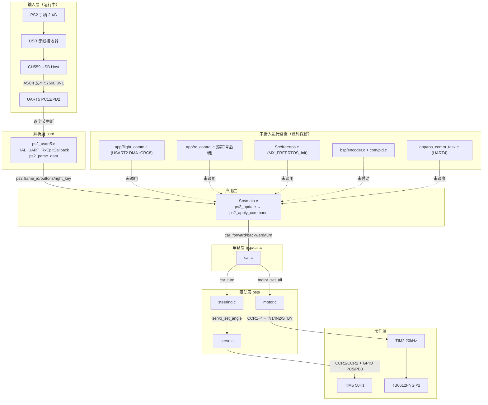
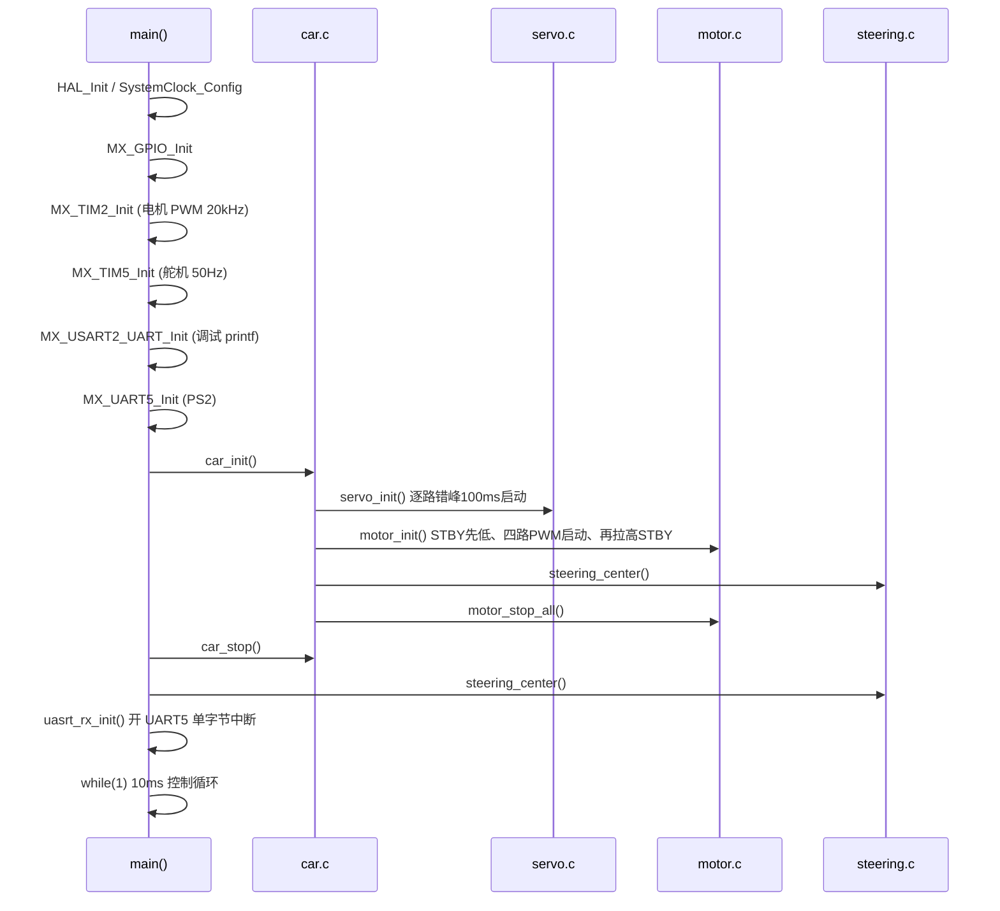
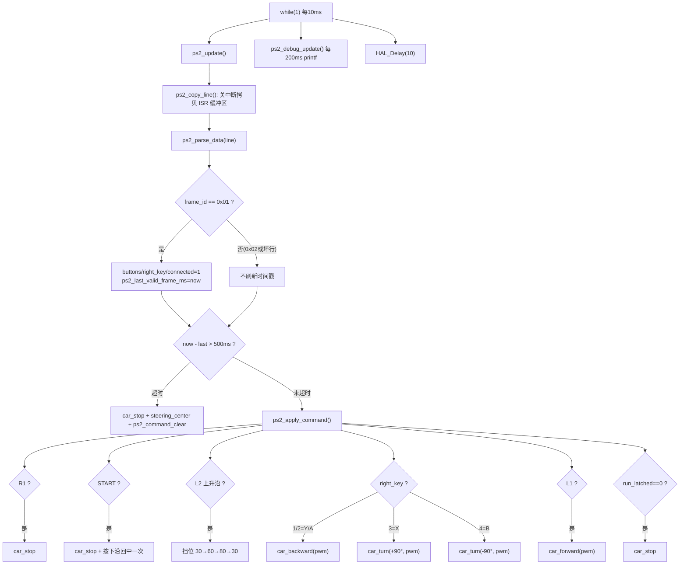
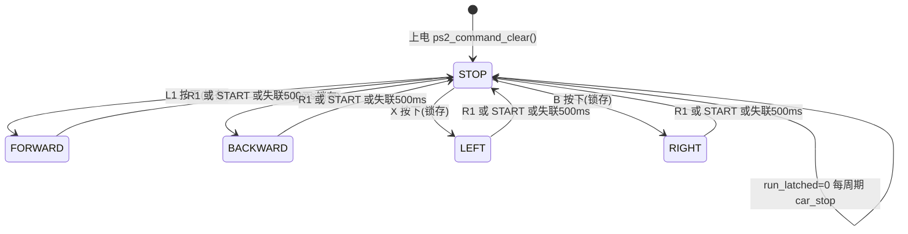
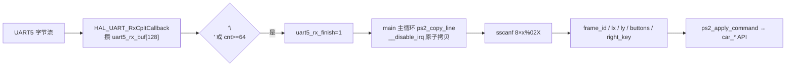
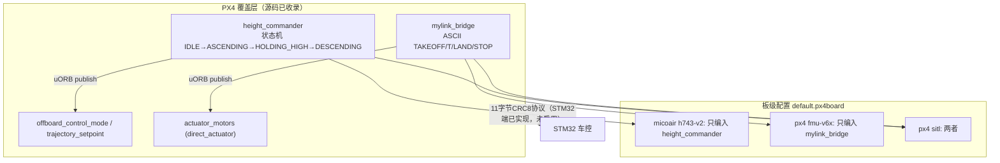

# 02 系统架构（System Architecture）

> 只描述「当前真实运行」的分层与流程，把【已接入运行】【源码存在但未接入】分开。所有框图按 `Src/main.c` / `bsp/*.c` / `app/*.c` 的真实调用关系生成。

## 1. 分层总览（真实调用链）

当前 `main()` 只初始化 GPIO / TIM2 / TIM5 / USART2 / UART5，然后进入裸机 10 ms 主循环；`flight_comm`、`rc_control`、FreeRTOS、编码器、ROS 都**不在运行路径**上（`Src/main.c` 第 364–399 行）。

> 分层规则证据：`TECHNICAL_DEVELOPMENT_DOCUMENT.md` 第 166–177 行 mermaid 分层图；「输入层只生成车辆级命令，只有底层驱动允许操作 TIM CCR 和 GPIO」。

## 2. 上电启动流程（真实顺序）

证据 `Src/main.c` 第 350–398 行 + `bsp/car.c` 第 93–105 行：

## 3. PS2 主循环控制流（含失联保护）

证据 `Src/main.c` 第 388–399 行（主循环）、第 146–174 行（`ps2_update`）、第 176–291 行（`ps2_apply_command`）。

## 4. 状态机：PS2 运动命令锁存（隐含状态机）

代码用「锁存变量 + 命令枚举」实现，不是显式 switch 状态机。核心状态变量（`Src/main.c` 第 77–92 行）：

| 变量 | 作用 |
|---|---|
| `ps2_run_latched` | 运动锁存（0=停，1=有运动命令挂起） |
| `ps2_motion_command` | `PS2_CAR_STOP/FORWARD/BACKWARD/LEFT/RIGHT` 枚举 |
| `ps2_l2_was_pressed` | L2 边沿去抖（一次按只切一挡） |
| `ps2_start_was_pressed` | START 回中只执行一次 |
| `ps2_speed_gear_index` | 0/1/2 → 30/60/80% |

## 5. 数据流：PS2 报告 → 车辆命令

证据 `bsp/ps2_usart5.c` 第 82–147 行 + `Src/main.c` 第 156–163 行：

## 6. 飞控侧（PX4 覆盖层）架构

当前**未与车控联通**，但与车控是同一系统目标。证据 `adhesion/README.md`：

## 7. 资源占用总表（面试速查）

| 资源 | 用途 | 引脚 | 状态 |
|---|---|---|---|
| TIM2 CH1~4 | 电机 PWM | PA15/PB3/PB10/PB11 | 运行 |
| TIM5 CH1/CH2 | 舵机硬件 PWM | PA0/PA1 | 运行 |
| TIM5 CH3/CH4 | 舵机软件 PWM（比较中断） | PC5/PB0 | 运行 |
| TIM1/3/4/8 | 编码器 | PA8/9, PB4/5, PB6/7, PC6/7 | 预留 |
| TIM6 | 编码器采样 20ms | — | 未启动 |
| USART2 | printf 调试 + 飞控协议 | PA2/PA3 | 运行（仅 printf） |
| UART4 | ROS 通信 | PC10/PC11 | 未初始化 |
| UART5 | PS2 | PC12/PD2 | 运行 |
| DMA1_Ch6/7 | USART2 RX/TX | — | 配置，RX 未用 |
| DMA2_Ch3 | UART4 RX | — | 配置，未用 |
| I2C（软件模拟） | IMU（0x50） | PB8/PB9 | 未初始化 |
| GPIO PC15/PB14 | TB6612 STBY | — | 运行 |
