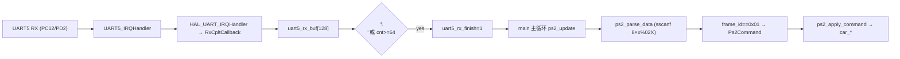
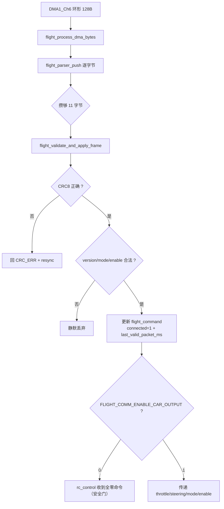

# 05 协议与数据流（Protocols & Dataflow）

> 逐字节讲清两条链路：PS2 文本协议（运行中）与 11 字节 CRC8 飞控协议（未启用，必须写明事实）。所有字段定义来自 `bsp/ps2_usart.h` / `app/flight_comm.c` / `FLIGHT_UART.md`。

---

## 1. PS2 链路协议（运行中）

### 1.1 物理层

| 项 | 值 | 证据 |
|---|---|---|
| 链路 | PS2 手柄 → 2.4G 接收器 → CH559 USB Host → UART5 | `TECHNICAL_DEVELOPMENT_DOCUMENT.md` 6.1 |
| UART5 引脚 | TX=PC12、RX=PD2 | `Src/usart.c` 185–193 行 |
| 波特率 | 57600、8N1、无流控 | `Src/usart.c` 73–79 行 |
| 接收方式 | 单字节中断 `HAL_UART_Receive_IT(&huart5,&rx_data,1)` | `ps2_usart5.c` 24–27 行 |
| 帧格式 | 一行 ASCII：`HUB0_Joystick data: x01 x80 x80 x80 x80 x0F x00 x00` | `TECHNICAL_DEVELOPMENT_DOCUMENT.md` 6.1 |

### 1.2 8 字节报告格式

解析入口 `ps2_parse_data()` 用 `sscanf(..., "HUB0_Joystick data: x%02X x%02X ...", 8 个)`（`ps2_usart5.c` 87–88 行）。

| 字节 | 字段 | 当前用途 | 证据 |
|---|---|---|---|
| Byte0 (x1) | `frame_id` | 只认 `0x01`，`0x02` 忽略 | `main.c` 157 行 |
| Byte1 (x2) | 右摇杆 X | 不用 | 文档 6.2 |
| Byte2 (x3) | 右摇杆 Y | 不用 | 文档 6.2 |
| Byte3 (x4) | 左摇杆 X | 映射为 `lx`（本版 PS2 固件不用摇杆） | `ps2_usart5.c` 96 行 |
| Byte4 (x5) | 左摇杆 Y | 映射为 `ly` | `ps2_usart5.c` 97 行 |
| Byte5 (x6) | 面键编码 | face 键（Y/A/X/B） | `ps2_usart5.c` 129–146 行 |
| Byte6 (x7) | 肩键/功能位图 | `buttons` 位掩码 | `ps2_usart5.c` 98 行 |
| Byte7 (x8) | 保留 | 解析但不使用 | — |

### 1.3 Byte6 位定义（肩键/功能键）

证据 `bsp/ps2_usart.h` 20–27 行：

```text
bit0 L1=0x01  bit1 R1=0x02  bit2 L2=0x04  bit3 R2=0x08
bit4 SELECT=0x10  bit5 START=0x20  bit6 L3=0x40  bit7 R3=0x80
```

> 注意：这是**位掩码**，多键同时按下时不能做 `==` 相等判断（`ps2_usart.h` 19 行注释）。

### 1.4 Byte5 面键编码

证据 `ps2_usart.h` 14–17 行 + `PS2_BASIC_DELIVERY.md` 48 行：

| 值 | 代码宏 | 含义（按手柄 ABXY 丝印） | main.c 动作 |
|---|---|---|---|
| `0x1F` | `KEY_TRIANGLE` | Y | `right_key==1` → 后退 |
| `0x4F` | `KEY_CROSS` | A | `right_key==2` → 后退 |
| `0x8F` | `KEY_SQUARE` | X | `right_key==3` → 左转+90° |
| `0x2F` | `KEY_CIRCLE` | B | `right_key==4` → 右转-90° |

### 1.5 数据流（字节 → 电机）



### 1.6 500 ms 失联判断（关键）

证据 `main.c` 146–174 行：

- 只有 `frame_id==0x01` 且 `sscanf` 完整解析 8 字节时，才 `ps2_last_valid_frame_ms = HAL_GetTick()`。
- 每 10 ms 主循环检查 `(now - ps2_last_valid_frame_ms) > 500` → `car_stop()+steering_center()+ps2_command_clear()`。
- 因此「手柄关机 / 拔接收器 / CH559 停发 / UART5 停更」都会在 500 ms 内停车，不会维持旧油门（`PS2_BASIC_CONTROL.md` 第 127–138 行）。

---

## 2. 11 字节 CRC8 飞控协议（**未启用，必须写清**）

### 2.1 事实声明

- 协议代码**完整存在**于 `app/flight_comm.c`，且做过 USB-TTL 往返诊断（返回 `OK/CRC_ERR`）。
- 但 `flight_comm.h` 第 15 行 `FLIGHT_COMM_ENABLE_CAR_OUTPUT 0`，且 `Src/main.c` **不调用** `flight_comm_init()`。
- USART2 当前被 `printf` 当作 PS2 调试口使用（`com_debug.c` `fputc` 重定向到 `huart2`）。
- 结论：**当前正式 PS2 运行固件不会接受飞控命令**（`FLIGHT_UART.md` 第 15–19 行、`TECHNICAL_DEVELOPMENT_DOCUMENT.md` 7.2）。

### 2.2 帧格式（11 字节）

证据 `FLIGHT_UART.md` 第 67–77 行 + `app/flight_comm.c` 8–16 行：

| 字节 | 字段 | 说明 |
|---|---|---|
| 0 | Header0 | `0xAA` |
| 1 | Header1 | `0x55` |
| 2 | version | 固定 `0x01` |
| 3 | enable | 0/1 |
| 4 | mode | 0=普通转向，1=蟹行 |
| 5..6 | throttle | int16，**大端**，限幅 -1000..1000 |
| 7..8 | steering | int16，大端，限幅 -1000..1000 |
| 9 | sequence | 0..255 |
| 10 | CRC8 | Byte0..Byte9 的 CRC |

### 2.3 CRC8 参数（CRC-8/ATM）

证据 `FLIGHT_UART.md` 第 81–92 行 + `flight_comm.c` 34–57 行：

- Polynomial `0x07`、Init `0x00`、RefIn/RefOut=False、XorOut `0x00`。
- 覆盖 Byte0~Byte9（10 字节）。
- 标准向量 `123456789` → `0xF4`。
- 合法帧回 `OK\r\n`；CRC 错回 `CRC_ERR\r\n`；version/mode/enable 非法**静默拒绝**（不发任何回包）。

### 2.4 安全测试帧（COMTool 用）

`FLIGHT_UART.md` 第 150–172 行：

```text
合法: AA 55 01 00 00 00 00 00 00 00 20  → 回 OK
CRC错: AA 55 01 00 00 00 00 00 00 00 00  → 回 CRC_ERR
```

### 2.5 DMA 环形接收与失步重同步

证据 `flight_comm.c` 223–249、146–177 行：

- `flight_comm_init()` → `HAL_UART_Receive_DMA(&huart2, flight_dma_rx_buffer, 128)`（DMA1_Channel6 Circular）。
- `flight_process_dma_bytes()` 用 `__HAL_DMA_GET_COUNTER` 计算写指针，消费新字节。
- `flight_parser_push()` 逐字节喂入 11 字节状态机；满 11 字节校验失败时 `flight_parser_resync()` 在缓冲内重新搜 `AA 55`，保证「丢一个字节不会永久错位后续所有帧」。

### 2.6 控制流



### 2.7 500 ms 超时（第二层）

`flight_comm_update()`（282–296 行）与 `rc_update()`（89–96 行）各有独立 500 ms 超时：`flight_comm` 层清零命令并 `car_stop()`，`rc_control` 层再兜底一次 `rc_enter_failsafe()`。

---

## 3. 两条链路的关系（面试必答）

| 维度 | PS2 链路 | 飞控协议链路 |
|---|---|---|
| 状态 | 运行中 | 未启用 |
| 物理口 | UART5（57600） | USART2（115200） |
| 帧类型 | ASCII 文本行 | 11 字节二进制 |
| 校验 | 无（靠 `sscanf` 成功=8 才接受） | CRC-8/ATM |
| 使能门 | `frame_id==0x01` | `enable` 字段 + `FLIGHT_COMM_ENABLE_CAR_OUTPUT` |
| 失联 | 500 ms 无 `0x01` | 500 ms 无合法帧 |

> 关键结论：两套协议**不是同一个**，也**没有仲裁层**。要组成正式链路，必须先实现「唯一控制源仲裁」+ USART2 与调试日志分离（`TECHNICAL_DEVELOPMENT_DOCUMENT.md` 7.4、`FLIGHT_UART.md` 第 40 行）。
