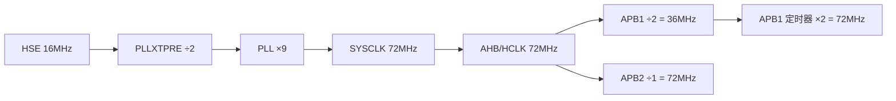

# 07 硬件交互（Hardware Interaction）

> 全部对应代码位置与寄存器级参数。硬件型号证据来自 `docs/TECHNICAL_DEVELOPMENT_DOCUMENT.md` 3.2、`car/README.md`、`.ioc`、`Src/tim.c`、`Src/usart.c`、`Src/gpio.c`。

---

## 1. 硬件基线

| 项 | 值 | 证据 |
|---|---|---|
| MCU | STM32F103RCT6（256KB Flash / 48KB RAM） | `.ioc` 42/107 行、`uvprojx` `<Device>` |
| 控制板 | WLKJ2025011 CAR-MOTOR-V1.2S | `car/README.md` 第 5 行 |
| 主电源 | 3S 锂电池 11.1 V 标称 / 12.6 V 满电 | 文档 3.2 |
| 舵机电源 | 板载 7.4 V 电源域 | 文档 3.2 |
| 电机驱动 | TB6612FNG ×2 | 文档 3.2 |
| 电机 | JGA25-370/371 12 V 减速电机，约 60 RPM，带 AB 编码器 | 文档 3.2 |
| 舵机 | FEETECH FT5325M，7.4 V ×4 | 文档 3.2 |
| 烧录 | ST-Link / SWD | `car/README.md` 第 6 行 |

## 2. RCC / 时钟树

证据 `Src/main.c` `SystemClock_Config()`（407–440 行）+ `.ioc`：

| 项 | 值 |
|---|---|
| 时钟源 | HSE（外部晶振 16 MHz，`.ioc` `RCC.HSE_VALUE=16000000`） |
| PLL 入口 | HSE ÷2（`RCC.HSEDivPLL=RCC_HSE_PREDIV_DIV2` → PLLXTPRE=1） |
| PLL 倍频 | ×9（`RCC_PLL_MUL9`） |
| SYSCLK | 72 MHz |
| AHB / HCLK | 72 MHz（`RCC_SYSCLK_DIV1`） |
| APB1 | 36 MHz（`RCC_HCLK_DIV2`）→ 定时器时钟 ×2 = 72 MHz |
| APB2 | 72 MHz（`RCC_HCLK_DIV1`） |
| Flash 延迟 | `FLASH_LATENCY_2`（匹配 48–72 MHz 段） |



> 追问：为什么 TIM2/TIM5（挂在 APB1）仍按 72 MHz 计数？→ F103 规定 APB1 预分频系数 ≠1 时，APB1 定时器时钟自动 ×2（`.ioc` `APB1TimFreq_Value=72000000` 佐证）。

## 3. GPIO 映射（全部对应代码）

### 3.1 电机方向 / STBY（`Src/gpio.c` 42–90 行 + `bsp/motor.c`）

| 功能 | GPIO | 初始化电平 |
|---|---|---|
| TB6612_1_AIN1（M1 正） | PC13 | RESET |
| TB6612_1_AIN2（M1 反） | PC14 | RESET |
| TB6612_1_STBY | PC15 | RESET（上电禁止） |
| TB6612_1_BIN1（M2 正） | PC0 | RESET |
| TB6612_1_BIN2（M2 反） | PC1 | RESET |
| TB6612_2_AIN1（M3 正） | PB13 | RESET |
| TB6612_2_AIN2（M3 反） | PB12 | RESET |
| TB6612_2_STBY | PB14 | RESET |
| TB6612_2_BIN1（M4 正） | PC9 | RESET |
| TB6612_2_BIN2（M4 反） | PC8 | RESET |
| LED（调试用） | PC2 | RESET |
| 按键输入 | PC4 | 上拉输入 |
| 软件 I2C（IMU） | PB8(SCL)/PB9(SDA) | 开漏输出 |

### 3.2 电机 PWM 引脚（TIM2，remap）

证据 `Src/tim.c` `HAL_TIM_MspPostInit`（504–537 行）：`__HAL_AFIO_REMAP_TIM2_ENABLE()`。

| 电机 | TIM2 通道 | 引脚 | 方向脚 |
|---|---|---|---|
| MOTOR_1/J1 | CH1 | PA15 | PC13/PC14 |
| MOTOR_2/J2 | CH2 | PB3 | PC0/PC1 |
| MOTOR_3/J3 | CH4 | PB11 | PB13/PB12 |
| MOTOR_4/J4 | CH3 | PB10 | PC9/PC8 |

> 注意 PA15/PB3 是 JTAG 脚，必须 remap 才能当 PWM；这是 STM32F103 的经典配置点。

### 3.3 舵机引脚（TIM5）

证据 `Src/tim.c` 538–556 行 + `bsp/servo.c`：

| 舵机 | 位置 | 接口 | 引脚 | PWM 实现 |
|---|---|---|---|---|
| LF | 左前 | J9 | PA0 | TIM5_CH1 硬件 PWM |
| RF | 右前 | J11 | PA1 | TIM5_CH2 硬件 PWM |
| LR | 左后 | J12 | PC5 | 软件 PWM（更新中断拉高 + CC3 拉低） |
| RR | 右后 | J14 | PB0 | 软件 PWM（更新中断拉高 + CC4 拉低） |

### 3.4 串口引脚

| 外设 | TX | RX | 波特率 | 用途 | 证据 |
|---|---|---|---|---|---|
| USART2 | PA2 | PA3 | 115200 8N1 | printf 调试 + 飞控协议（DMA1_Ch6/7） | `usart.c` 92–118、227–256 行 |
| UART4 | PC10 | PC11 | 115200 8N1 | ROS（DMA2_Ch3，未用） | `usart.c` 35–61、147–162 行 |
| UART5 | PC12 | PD2 | 57600 8N1 | PS2（单字节中断） | `usart.c` 63–89、185–197 行 |

### 3.5 编码器引脚（预留）

| 定时器 | GPIO | 状态 | 证据 |
|---|---|---|---|
| TIM1 | PA8/PA9 | 编码器资源保留 | `tim.c` 376–388 行 |
| TIM3 | PB4/PB5（partial remap） | 保留，PB5 不得复用 | `tim.c` 401–415 行 |
| TIM4 | PB6/PB7 | 保留 | `tim.c` 425–437 行 |
| TIM8 | PC6/PC7 | 保留 | `tim.c` 444–458 行 |

## 4. TIM2 电机 PWM 参数

证据 `Src/tim.c` 95–100 行：

```text
PSC=35, ARR=99
PWM 频率 = 72MHz / (35+1) / (99+1) = 20 kHz
满量程 = ARR+1 = 100 计数（软件把 100 当作 100%）
```

- 驱动层 `pwm_max=80`（`motor.c` 30–36 行），PS2 挡位 30/60/80%。
- `motor_percent_to_pwm(30)` → `100*30/100 = 30` 个计数。

## 5. TIM5 舵机 PWM 参数

证据 `Src/tim.c` 249–253 行 + `bsp/servo.c` 22–28 行：

```text
PSC=71, ARR=19999
周期 = 72MHz / (71+1) / (19999+1) = 20 ms = 50 Hz
计数单位 = 1 μs（72MHz/72=1MHz）
中位 1500μs / 范围 1300~1700μs / direction=+1
```

- `servo_set_angle(±90°)` 把角度线性映射到 1300~1700 μs，再 `servo_set_us` 限幅。
- CH3/CH4 用 `TIM_OCMODE_TIMING`（只比较不输出物理脚），配合 GPIO 软件翻转（`servo.c` 126–135 行）。

## 6. TB6612 方向控制（`bsp/motor.c`）

`motor_apply_output()`（63–91 行）真值表：

| signed_pwm | IN1 | IN2 | PWM 幅值 |
|---|---|---|---|
| > 0（前进） | SET | RESET | magnitude |
| < 0（后退） | RESET | SET | magnitude |
| = 0（停止） | RESET | RESET | 0（滑行停止） |

STBY：`PC15`（TB6612_1）与 `PB14`（TB6612_2）同时控制（`motor_set_standby`，56–61 行）；`motor_init()` 先拉低 STBY、四路 PWM 启动成功后才拉高（146–180 行）。

## 7. ST-Link 烧录（`TECHNICAL_DEVELOPMENT_DOCUMENT.md` 10.2）

1. 小车断开动力负载或四轮完全架空。
2. ST-Link SWDIO/SWCLK/GND 接板端；板载电池供电时避免 ST-Link 3.3V 反向供电。
3. Keil `Options for Target → Debug` 选 ST-Link Debugger，`Settings` 选 SWD。
4. `Utilities` 选 Use Target Driver for Flash Programming。
5. Download 后**不自动运行**，断开重上电，先确认电机停、舵机回中。

## 8. 电源分域（安全红线）

证据 `TECHNICAL_DEVELOPMENT_DOCUMENT.md` 3.3 / 9.x：

- 无人机主动力、小车直流电机、舵机、数字逻辑**分域供电并共地**。
- 禁止用飞控 5 V 外设口带 4 个大扭矩舵机。
- 飞控—车控串口只接 TX/RX/GND，默认不接 5 V。
- 舵机 7.4 V 大电流回路不应与信号地共用细长回流路径。
